# Will AI Break the Planet?

### The AI Infrastructure Boom and the Race Against the Climate's Point of No Return

 

---

# Prologue: The Calculation That Got Skipped

## A strange quirk in human arithmetic

Human beings have a strange quirk in how they do arithmetic.

A threat right in front of us looks bigger than it is. A threat far away looks smaller than it is. 
We brace with everything we have against dangers that hurt immediately, yet somehow do nothing about dangers that approach slowly but surely.

Behavioral economics calls this "hyperbolic discounting" 
— the tendency to discount the value of the future steeply in proportion to its distance in time. 
Offered ¥10,000 tomorrow versus ¥12,000 a year from now, most people take the ¥10,000 tomorrow. 
An extraordinary return of 20% a year, surrendered simply because it is "far away."

Psychologists have another term: the "finite pool of worry." 
The total amount of worry a person can hold at once has a ceiling, and when an immediate anxiety fills that space, distant anxieties are automatically pushed out. 
When your head is full of worry about next month's bills, you have no room left to think about the climate decades from now. 
This is not weakness of will; it is a structural constraint of cognition.

These two quirks are now operating at the same time, at the site of one of the largest decisions in human history.

## What people are making noise about in 2026

In 2026, AI became the central topic of society. 
The subject discussed most fiercely is "jobs."

AI will take our work. Entry-level positions will vanish. New graduates won't find jobs. The white-collar middle will collapse. 
These arguments fill the media, spread across social platforms, appear in politicians' speeches, and are discussed at family dinner tables.

This is only natural. Job loss is an immediate, visible, personal threat. 
Next month's paycheck, next year's career, your child's first job — all of them close enough to touch. 
Human cognition is built to respond to threats this near correctly and intensely.

Meanwhile, there is a question almost no one is counting the stakes of.

**The world's AI companies, capital, governments, and media are pouring tens of trillions of yen into AI infrastructure.** 
**In the process of supplying the enormous electricity this requires, exactly how much CO2 will be emitted,** 
**and what will it ultimately bring to the planet, and to humanity?**

This question is long-term, invisible, probabilistic, and diffuse in its responsibility. 
And so the quirks of human cognition structurally underestimate it. 
The gap between the heat of public opinion poured into job loss and the thinness of attention directed at this question is astonishingly wide.

This book takes that thinness as its problem.

## Where this book stands

Let me make the book's position clear at the outset.

This is not a doomsday tract claiming "AI will destroy the planet." Nor is it a book that denies AI's benefits. Quite the opposite. 
This book begins by taking seriously — without optimism — the most authoritative official view spoken on this issue: 
the relatively optimistic forecast of the International Energy Agency (IEA) that 
"data-center CO2 is only about 1% of global emissions and will peak out around 2030."

Because it is precisely that official optimism that deserves to be read most carefully.

The IEA's numbers are correct. 
Data-center CO2, measured in absolute terms, is small within the global total. This is a fact. 
This book does not deny it. There is no need to.

But what this book questions is not "quantity." 
**It is "direction" and "time."**

First, that forecast of a "peak-out" rests on one significant assumption: 
that small modular reactors (SMRs), new nuclear plants, grid expansion, and accelerating renewables 
— "technologies and facilities that do not yet exist" — will all arrive on schedule. 
That is not a forecast. It is a bet.

Second, the time horizon on which that bet is said to "arrive in time" overlaps 
with the horizon on which the risk of the Earth's climate crossing an irreversible tipping point rises sharply. 
By the time low-emission power finally arrives, it may already be too late.

Third, what awaits beyond the irreversible line 
— shrinking habitable land, struggles over water and crops, conflict, and massive loss of human life — 
is something humanity structurally underestimates compared with immediate threats like job loss.

## Four fragmented conversations

What this book attempts is to connect, with a single line, four conversations that have until now been spoken of separately.

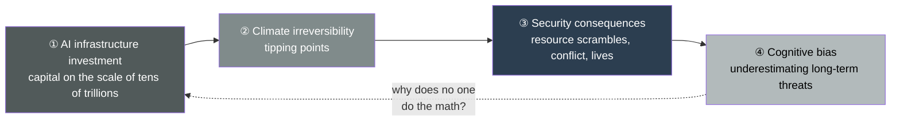

There are economic analysts who discuss the scale of AI investment. 
There are climate scientists who discuss the climate's tipping points. 
There are security experts who discuss resource conflict. 
And there are behavioral economists who discuss human cognitive bias. 
Each speaks accurately, within their own domain.

But a vantage point that ties these four together with a single line 
— integrating them into one structure in which "AI infrastructure investment is colliding, on the axis of time, with the climate's irreversible line" — is decisively lacking. 
The stakes are recorded, scattered here and there. But no one has assembled them into a single invoice.

This book stands in that empty space.

The smartest people in the world are skipping the most important calculation. 
One by one, this book will lay that skipped calculation out on the table.

So let us begin with scale. 
Without knowing how enormous the stakes are, we cannot grasp the weight of the bet.

## Note

All figures in this book are based on primary sources as published at the time of writing. 
Sources include the IEA's "Energy and AI," LBNL's "Queued Up," the WMO's annual climate outlook, the Global Tipping Points Report, national security assessments, and corporate earnings disclosures. 
Reference URLs are listed at the end of each chapter. 
The figures should be updated as the assumptions of the scenarios — especially the progress of SMRs, grids, and renewables — change.

### References
- IEA, "Energy and AI" (2025): https://www.iea.org/reports/energy-and-ai
- Carbon Brief, "AI: Five charts that put data-centre energy use – and emissions – into context" (2025): https://www.carbonbrief.org/ai-five-charts-that-put-data-centre-energy-use-and-emissions-into-context/

 

---

# Chapter 1: Investment of a Different Order

## 1.1 The reality of tens of trillions in motion

Let us begin with numbers. 
An argument without a felt sense of reality yields only conclusions without a felt sense of reality.

In 2025, the world's major technology companies poured capital into AI infrastructure on a scale never before committed to a single industry. 
Let us pull the actual capital-expenditure (CapEx) figures from each company's earnings disclosures.

Microsoft's spending on property and equipment in fiscal 2025 was about $64.6 billion, up roughly 45% from about $44.5 billion the year before. 
Alphabet (Google) spent about $91.4 billion in 2025, up about 74% from roughly $52.5 billion. 
Amazon's purchases of property and equipment in 2025 reached about $128.3 billion, up about 65% from roughly $77.7 billion. 
Meta's capital expenditure in 2025 was about $72.2 billion.

These four companies alone totaled about $356.5 billion in 2025. 
In yen, roughly ¥55 trillion. A single year. A single cluster of firms. Capital expenditure alone. 
Considering that Japan's general-account national budget is on the order of ¥110 trillion, four companies poured the equivalent of half of it into infrastructure in a single year.

And this is only the run-up.

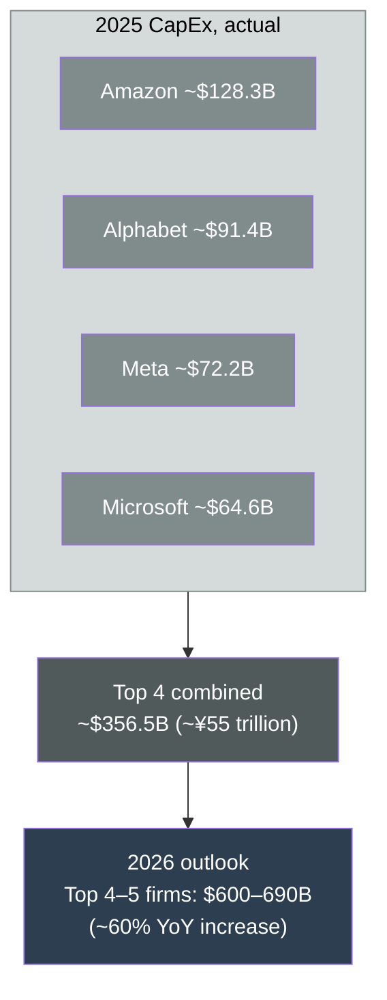

The IEA expects the CapEx of the largest technology firms to have exceeded $400 billion in 2025 and to rise a further 75% in 2026. 
Stacking up each company's 2026 guidance, the combined total for the top four to five firms is projected to reach $600 billion to $690 billion. 
That is roughly a 60% year-on-year increase.

## 1.2 Capital that surpassed oil

The IEA captures the abnormality of this investment scale in a single comparison.

**The capital expenditure of these tech giants now exceeds the entire world's investment in oil and natural gas production.**

This means the center of gravity of civilization's energy is shifting. 
Through the 20th century, humanity devoted its greatest capital to digging fossil fuels out of the ground. 
That was the premise that drove industry, lit cities, and turned the economy. 
But in 2026, humanity is spending more money to build AI's computational capacity than to dig energy out of the ground.

Compute has become the new oil. 
But to run that compute, in the end, requires enormous amounts of electricity. 
And electricity still depends, in large part, on fossil fuels. 
Here is the starting point of the cycle this book dissects. 
AI, a "new energy consumption," is in fact deepening dependence on "old energy sources."

## 1.3 The physical shape of the investment

Where do these tens of trillions of yen go? 
Let us look at their physical shape.

The great majority becomes data centers. 
Servers, GPUs, cooling equipment, and the substations and transmission lines to draw in power. 
Abstract "investment" ultimately turns into enormous buildings on the ground and the physical infrastructure that sends electricity to them.

Emblematic is the "Stargate" initiative led by OpenAI. 
Its targeted power scale is 10 gigawatts. 
Measured against the annual electricity consumption of an average U.S. household, that is equivalent to roughly 7.5 to 10 million households. 
A single data-center initiative demands electricity rivaling a major metropolitan area of an entire country.

Its flagship campus in Abilene, Texas, is planned to consume about 1.2 gigawatts when all buildings are operational 
— roughly 750,000 households — deploying up to 450,000 GPUs. 
As of the end of 2025, about $450 billion in investment had been committed.

The abstract number of "electricity" eventually becomes concrete friction with land and residents. 
A Stargate facility being built in Michigan is planned to consume about 1.4 gigawatts on its own, 
but construction proceeded over the objection of local residents who opposed it by a margin of four to one. 
Nineteen surrounding municipalities have enacted ordinances temporarily halting new data-center development. 
The scramble for electricity is already not an abstract future projection but a real conflict within local communities.

## 1.4 The bet's source of funds

And the abnormality of this investment shows in the source of its funds as well.

Tech giants were once synonymous with companies holding abundant cash. 
Using the vast cash earned from advertising and subscriptions, they invested with their own funds. That was their strength. 
But now capital expenditure has begun to exceed their own operating cash flow, 
and they are shifting toward a model that depends on external borrowing — leverage.

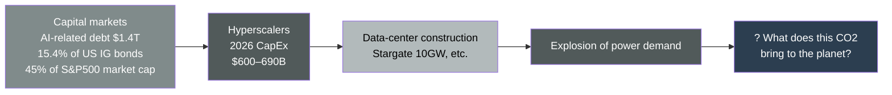

According to press tallies, AI-related debt reached a record high of $1.4 trillion, 
becoming the largest segment at 15.4% of U.S. investment-grade bonds (highly creditworthy corporate debt). 
The U.S. corporate bonds issued by the five hyperscalers in 2025 totaled $121 billion, more than four times the 2020–2024 annual average of $28 billion. 
Furthermore, by Goldman Sachs's analysis, AI-related stocks have come to make up about 45% of the S&P 500's market capitalization. 
That is nearly double the roughly 25% at the time of ChatGPT's release in November 2022.

What this means is that AI infrastructure investment is no longer an internal matter of the tech industry. 
A massive bet called AI infrastructure is now embedded at the core of the world's financial markets. 
Part of the investment-grade bonds bought by pension funds, and a large portion of the equity indexes we hold, are linked to this bet. 
Building infrastructure physically is being funded with overwhelming priority over consideration for the climate — that is the reality of 2026.

## 1.5 Chapter summary

What this chapter confirmed is the scale of the stakes. 
The top four firms alone move ¥55 trillion a year; in 2026 a handful of major firms will move over $600 billion in AI infrastructure investment, exceeding the world's investment in oil and gas production. 
The funds are no longer covered by their own cash and are embedded in the debt and equity that sit at the core of the world's financial markets. 
And that investment ultimately turns into data centers demanding electricity rivaling a nation's metropolitan area.

At this scale, surely CO2 will be in serious trouble too — that is the natural thought. 
But here we run into a surprising fact. The official bodies do not say so. 
In the next chapter, we will take that official view in its most honest form.

### References
- Microsoft, FY2025 Annual Report: https://www.microsoft.com/investor/reports/ar25/index.html
- IEA, "Key Questions on Energy and AI" (2025): https://www.iea.org/reports/key-questions-on-energy-and-ai
- IEA, "Energy and AI" (2025): https://www.iea.org/reports/energy-and-ai

 

---

# Chapter 2: The Official Optimism

## 2.1 The IEA says "it's fine"

The International Energy Agency (IEA) is one of the most authoritative analytical bodies on energy in the world. 
It has provided the benchmark data that national governments use when setting energy policy. 
In 2025, that IEA released, for the first time, a report dealing head-on with the relationship between AI and energy: "Energy and AI."

Its contents are, contrary to many people's intuition, fairly calm.

Data-center electricity consumption was about 415 terawatt-hours (TWh) in 2024. 
In the IEA's central scenario (Base Case), this more than doubles to about 945 TWh by 2030. 
That 2030 level rivals the total electricity consumption of all of Japan today. 
By 2035 it reaches about 1,200 TWh.

Electricity consumption does indeed grow explosively. But here is the crucial part. 
**Even as consumption doubles, the IEA does not see CO2 increasing catastrophically.**

## 2.2 The peak-out forecast

Let us trace data-center power-related CO2 emissions in the IEA's central scenario.

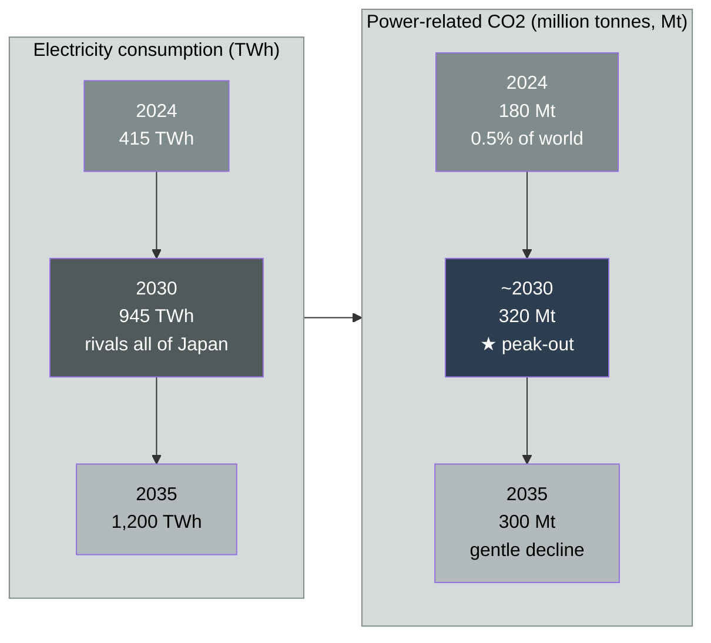

Power-related CO2 emissions were about 180 million tonnes in 2024. 
In the IEA's central scenario, this peaks at about 320 million tonnes around 2030, 
then declines gently to about 300 million tonnes by 2035.

Let us place this number within the global total. 
World CO2 emissions in 2024 are estimated at about 41.6 billion tonnes. 
Data-center power-related emissions are only about 0.5% of that. 
In the IEA's forecast, even in 2030 the share of data centers in world CO2 emissions stays at about 1% in the central scenario, and about 1.4% even in the high-growth scenario. 
Even in 2035, it is less than 1.5% of emissions from the entire energy sector.

"Electricity consumption doubles. But CO2 is around 1%, and it peaks out" — this is the gist of the IEA's view.

Why does CO2 peak out even as consumption doubles? 
The IEA's logic is this. Electricity consumption itself rises. 
But the power sources that supply that electricity shift from coal and natural gas to renewables and nuclear. 
So the CO2 per unit of consumption (carbon intensity) falls, and total emissions hit a ceiling at some point and turn to decline.

## 2.3 The strongest version of the optimism

And the IEA presents an even bolder "strongest version of the optimism." 
Precisely because this is the opponent the book will rebut in later chapters, it must be introduced here in its strongest form.

AI does not only consume electricity. 
Using AI, one can make grid operations more efficient, reduce energy waste, and accelerate the development of decarbonization technologies. 
It can optimize supply and demand on the transmission grid, forecast the fluctuating output of renewables, and raise the energy efficiency of industrial processes. 
The IEA estimates that simply by broadly implementing already-available AI applications in the power and energy sector, 
there is room for reductions equivalent to about 5% of energy-related emissions in 2035.

This is a claim that cannot be ignored. 
If data centers' own emissions are about 1% of the world's, while the reductions AI brings could amount to 5% of energy-sector emissions, 
then **on net, AI could be a positive for the climate** — even that argument can be made. 
The naive criticism that "AI is a villain that eats electricity" is easily refuted on this single point.

In addition, the IEA shows that lightweight AI use carries a small power burden. 
For example, even fully replacing conventional search with simple AI search would add less than 4 TWh of power demand per year, by its estimate. 
Everyday use of AI does not immediately scorch the planet.

## 2.4 Chapter summary

What this chapter confirmed is the content of the official optimism. 
Data-center CO2 is small, about 1% of the world total. 
In the central scenario it is forecast to peak out. 
And AI, through efficiency gains in the energy sector, could contribute reductions that exceed its own emissions. 
An authoritative international body says so, based on data.

So is the book's question idle worry? 
"How much CO2 comes from tens of trillions in infrastructure investment?" — the answer is "seen against the whole world, very little." 
Does the story end there?

It does not end. 
Because written into this beautiful optimistic scenario, small but decisive, is a single word. 
"If — low-emission power — arrives in time." 
In the next chapter, we dissect that one word.

### References
- IEA, "Energy and AI — Executive Summary" (2025): https://www.iea.org/reports/energy-and-ai/executive-summary
- IEA, "Energy and AI — AI and Climate Change" (2025): https://www.iea.org/reports/energy-and-ai/ai-and-climate-change
- IEA, "Global data centre CO2 emissions, Base Case, 2020-2035": https://www.iea.org/data-and-statistics/charts/global-data-centre-co2-emissions-base-case-2020-2035

 

---

# Chapter 3: The True Nature of the Bet

## 3.1 The three assumptions the peak-out depends on

The IEA peak-out forecast seen in the last chapter is not an outlook that materializes automatically. 
The IEA itself states clearly in the report that its realization depends on several conditions.

The conditions are these. 
Of the electricity demand that grows through 2035, roughly half must be met with renewable energy. 
The renewable share of data-center electricity must rise from about 27% today to about 50% by 2035. 
And from 2030 onward, small modular reactors (SMRs) must join the supply as low-emission baseload power. 
That these are achieved "simultaneously, on schedule" is the premise of the peak-out.

Conversely, the IEA states clearly that through 2030, natural gas and coal will supply more than 40% of the additional demand. 
The "bridge" until low-carbon power arrives in time is fossil fuel.

In other words, the structure is this. 
**The peak-out curve is drawn on the premise that low-emission power ramps up on schedule.** 
**If that ramp-up is delayed, the fossil-fuel patch is prolonged, and the CO2 peak slides backward.**

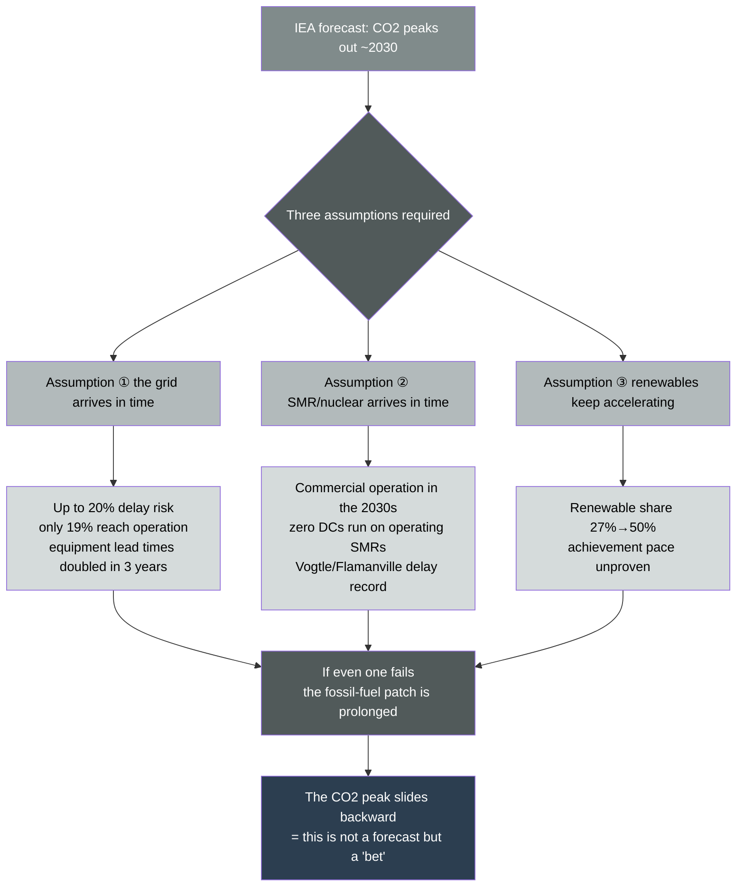

So how solid are those assumptions — the grid, SMRs and nuclear, renewables? 
Let us verify them one by one, with primary sources.

## 3.2 The grid: the largest bottleneck

What the IEA itself warns about most frankly is the transmission grid. 
The IEA states that, without fundamental measures to address grid constraints, 
up to 20% of planned data-center projects could be delayed.

This warning is backed up by actual U.S. data. 
According to Lawrence Berkeley National Laboratory's (LBNL) "Queued Up" report, 
generation and storage projects waiting for grid interconnection in the U.S. totaled, as of the end of 2024, 1,400 GW of generation plus 890 GW of storage — about 2,290 GW combined. 
That means an amount equivalent to roughly twice existing U.S. generation capacity is standing in line, waiting to connect.

And the line moves agonizingly slowly. 
For projects that reached commercial operation in 2024, the time spent waiting in line averaged about 55 months — four and a half years. 
More serious still is the fact that, historically, only about 19% of projects that apply actually reach the start of operation. 
The great majority of the rest withdraw after a long wait.

There is a point to be careful about. 
In the latest end-of-2025 data, the interconnection queue fell to about 2,060 GW, down about 12% year on year. 
But it is a mistake to read this as "constraints easing." 
The main cause of the decline is a drop in new applications and withdrawals on a historic scale. 
In 2024, against about 500 GW of new applications, about 700 GW withdrew from the queue. 
The line grew shorter not because the road widened, but because many projects gave up.

On top of this, the parts to physically build the grid are also in short supply. 
According to the IEA, the wait time for delivery of critical equipment such as transformers and cables has nearly doubled in the past three years. 
Building transmission lines themselves takes four to eight years. 
"Connecting as much electricity as you want, where you want it, when you want it" is no longer a given. 
A data center can be built in one to two years, but the grid that sends electricity to it takes several times longer. 
This time lag prolongs the fossil-fuel "stopgap."

## 3.3 SMR/nuclear: the trump card that isn't running yet

As a stable, 24/7/365 low-carbon power source, 
what the hyperscalers are pinning their hopes on is nuclear, and SMRs (small modular reactors) in particular.

The scale of expectation is certainly large. 
According to the IEA, the pipeline of conditional procurement agreements between data-center operators and SMRs expanded from 25 GW at the end of 2024 to 45 GW. 
Microsoft has signed a 20-year power-purchase agreement with Constellation toward restarting Unit 1 of the Three Mile Island plant 
(about 835 MW, renamed the Crane Clean Energy Center). 
Amazon and Google, too, have announced one agreement after another with SMR developers.

But a contract is not electricity. 
Only when it actually generates power does it become electricity.

Here is the heart of the bet. 
**Commercial operation of SMRs is in the 2030s.** 
**And at present, there is not a single data center anywhere in the world drawing electricity from an operating SMR.** 
As for large new nuclear plants, development and construction take five to ten years.

History has shown, again and again, that nuclear projects do not go according to plan. 
Units 3 and 4 of the Vogtle plant in Georgia, USA, were initially estimated at about $14 billion in construction cost; the final figure exceeded $30 billion. Completion was also greatly delayed. 
France's Flamanville Unit 3 suffered about €23.7 billion in cost and a full 12 years of delay. 
Nuclear has almost never shown up at the promised time, at the promised cost.

That SMRs ramp up on schedule in the 2030s — in light of past performance, this is a considerably optimistic assumption. 
And until they ramp up, what fills the gap is, as the IEA itself acknowledges, natural gas. 
In fact, orders for gas turbines in the U.S. have reached a scale of 136 GW, a record high in the past 25 years. 
Fossil fuel, supposedly a "bridge," is being driven into the ground as long-lived fixed equipment. 
A gas-fired plant, once built, runs for decades and keeps emitting CO2.

## 3.4 The wavering CO2 number

So far the discussion has been about "whether the assumptions arrive in time." 
But there is a problem one layer deeper. 
The very "0.5% of world emissions" figure seen in the last chapter changes greatly depending on what is being measured.

The IEA's figure of 180 million tonnes refers to the "indirect emissions" from generating the electricity that data centers consume. 
But this is not the whole of a data center's environmental burden.

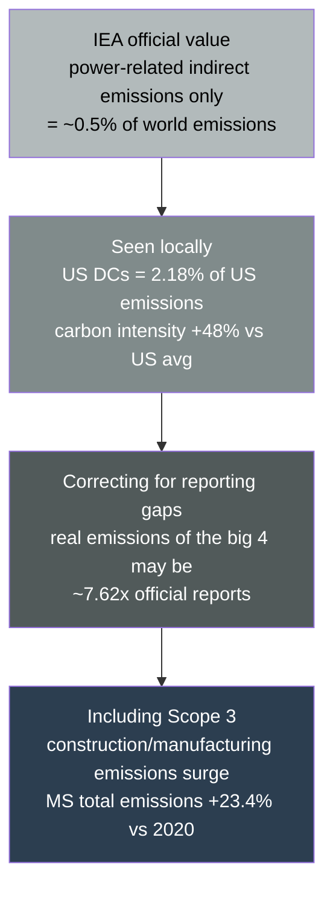

Independent research paints a different picture. 
According to a study of 2,132 U.S. data-center facilities from September 2023 to August 2024, 
these facilities accounted for over 4% of U.S. electricity consumption, 56% of that electricity was fossil-derived, and they produced over 105 million tonnes of CO2-equivalent emissions. 
That is equivalent to 2.18% of 2023 U.S. emissions. 
Furthermore, the carbon intensity of data centers — CO2 per unit of electricity consumed — exceeded the U.S. average by a full 48%. 
This is because their locations are skewed toward regions heavy in fossil fuels.

"0.5% of the world" and "2.18% of the U.S." 
This gap is not only a difference of denominator (world versus U.S.). 
It reflects the structure of local concentration, which an average value conceals. 
Data centers are not spread evenly across the world; they cluster in specific regions. 
They load the electricity grid of that region, in competition with that region's residents.

There is also doubt about corporate self-reporting itself. 
According to an analysis by The Guardian, from 2020 to 2022, 
the actual emissions of Google, Microsoft, Meta, and Apple may have been about 7.62 times their officially reported figures. 
Look at the "raw emissions" before subtracting offsets from renewable energy certificates (RECs), and the picture is entirely different. 
Supply-chain-wide emissions from cement and steel for construction, and from hardware manufacturing (Scope 3), have increased dramatically at every firm. 
In Microsoft's 2025 report, total emissions (Scope 1, 2, and 3) were up 23.4% from 2020. 
The company's energy use increased 168% over the same period.

## 3.5 Chapter summary

What this chapter confirmed is the fragility of the foundation on which the official optimism stands. 
The IEA's "1%, peak-out" is not wrong. 
But it is a conditional scenario standing on three "if it arrives in time"s: (1) the grid arrives in time, (2) SMRs and nuclear arrive in time, and (3) renewables accelerate rather than slow. 
Every one of these carries a bottleneck the IEA itself acknowledges, and in light of past performance, the risk of delay is high. 
And the CO2 figure being measured itself changes shape greatly depending on whether one looks only at indirect emissions, or at local concentration, Scope 3, and reporting gaps as well.

This is not a forecast. It is a bet. And the bet takes time. 
We must wait until SMRs ramp up, until the grid is in place. 
The problem is that, while we wait, another clock is ticking. The Earth's clock. 
In the next chapter, we overlay those two clocks.

### References
- IEA, "Energy and AI — AI and Climate Change" (2025): https://www.iea.org/reports/energy-and-ai/ai-and-climate-change
- LBNL, "Queued Up: 2025 Edition" (2025): https://emp.lbl.gov/queues
- IEA, "The Path to a New Era for Nuclear Energy" (2025): https://www.iea.org/reports/the-path-to-a-new-era-for-nuclear-energy
- "Environmental Burden of United States Data Centers in the AI Era," arXiv 2411.09786 (2024): https://arxiv.org/pdf/2411.09786
- Data Centre Magazine, "What is the Truth About Future AI & Data Centre Emissions?" (2025): https://datacentremagazine.com/news/what-is-the-truth-about-future-ai-data-centre-emissions

 

---

# Chapter 4: The Collision of Timelines

## 4.1 The Earth has a line of no return

The Earth's climate has a line from which there is no return.

Scientists call it a "tipping point." 
It is the point at which, once a threshold is crossed, a system runs away in a self-reinforcing manner and cannot return to its original state. 
A boulder that has begun rolling down a slope, once past a certain gradient, can no longer be stopped by hand. 
The climate system, too, has tipping points with that same structure — several of them.

The Greenland ice sheet, the West Antarctic ice sheet, the Atlantic Meridional Overturning Circulation (AMOC), the Amazon rainforest, 
permafrost, warm-water coral reefs, the boreal forests — all are known as tipping elements. 
When, for example, the Greenland ice sheet crosses a threshold and begins to melt, its elevation drops, surface temperature rises, and that further accelerates the melting. 
Once in this self-reinforcing loop, no matter how much CO2 humanity cuts, the melting will not stop. 
That is what "irreversible" means.

These tipping points were once said to be "a distant future, after several degrees of warming." 
But scientific understanding has been updated rapidly in a more severe direction over the past few years.

## 4.2 The tipping points are nearer than we thought

A series of studies published from 2023 to 2025 reached a shocking conclusion.

Even at less than 1.5°C of warming, up to eight tipping points could be reached. 
What was once said to be "a distant matter happening at 2°C or 3°C" 
turns out to be possible just short of the 1.5°C line that the Paris Agreement is fighting to hold.

And reality is already moving. 
The "Global Tipping Points Report 2025" reported that warm-water coral reefs cross their critical threshold at about 1.2°C, 
and at the current level of about 1.4°C are becoming the first ecosystem to cross a planetary-scale tipping point. 
Coral reefs are the foundation of marine ecosystems, supporting the fisheries and coastal protection on which hundreds of millions of people depend. 
That first domino is already beginning to fall.

"Irreversible" is not a metaphor. 
As a scientific term, it is said precisely that way. 
And that line is much nearer than we thought.

## 4.3 The two clocks

Here we enter the heart of the book. Let us set two clocks side by side.

**The first clock — "the timeline on which the solution arrives in time."** 
As seen in Chapter 3, the full-scale contribution of SMRs that supports the peak-out is from 2030 onward. 
New builds and restarts of large nuclear plants center on 2028–2029 and later. 
Building out the grid takes several years to a decade. 
In other words, the earliest that low-emission power can sufficiently cover data-center demand is the 2030s.

**The second clock — "the timeline on which the irreversible line is crossed."** 
The World Meteorological Organization (WMO), in its 2026 outlook, 
put the probability that at least one year between 2026 and 2030 temporarily exceeds 1.5°C at 91%. 
In the previous year's outlook, the probability that the 2025–2029 five-year average exceeds 1.5°C was put at 70%. 
The probabilities are being revised upward year after year. 
The Earth's clock is running faster than expected.

What do we see when we overlay these two clocks?

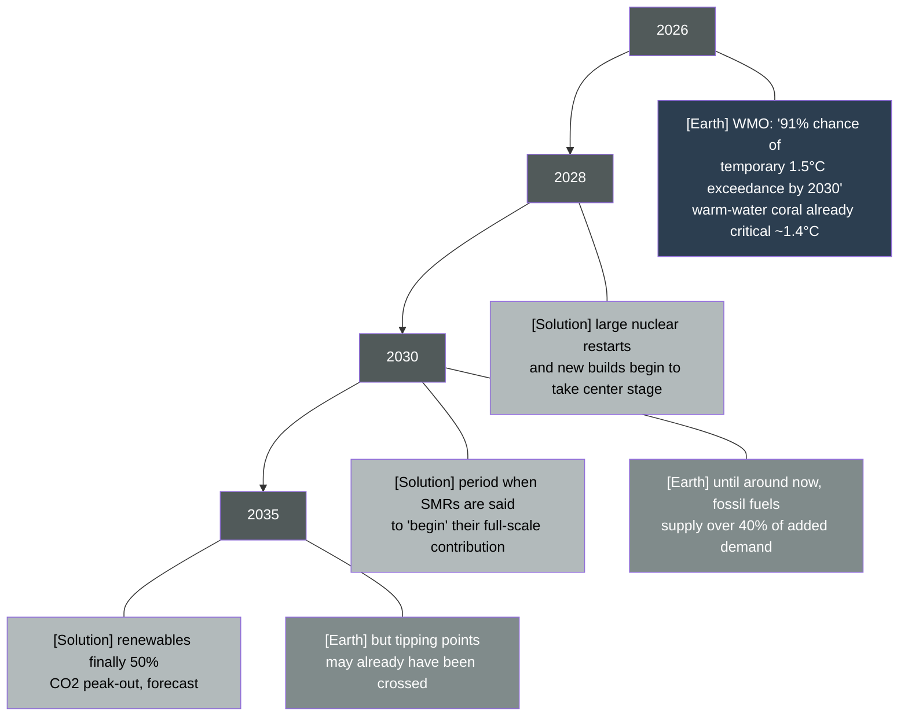

**The year low-emission power is said to "arrive in time" overlaps with the year the Earth enters irreversible critical risk.**

In the very years humanity is waiting for the implementation of new clean-energy technology, the climate system draws nearer to its irreversible line. 
By the time low-emission power finally arrives, at least some tipping points may already have been crossed.

## 4.4 The structure of the collision

Let us show this collision at one further level of abstraction. 
The problem is that the two clocks run at different speeds.

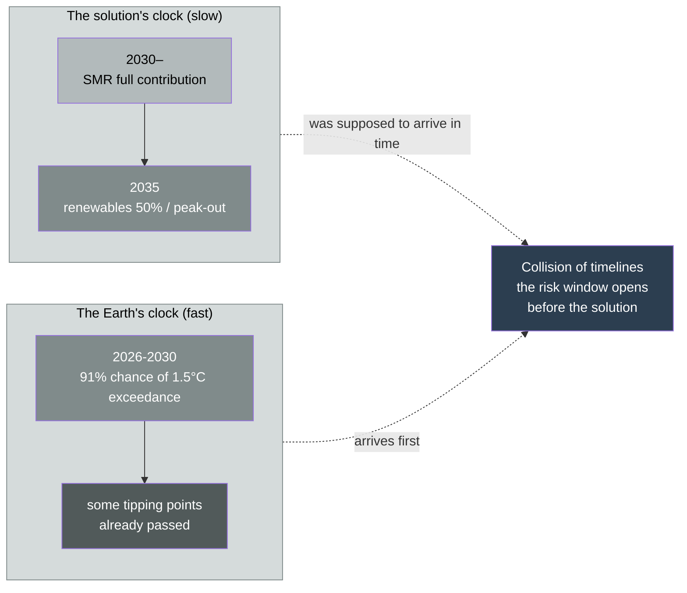

The tens of trillions of yen of investment seen in Chapter 1 does not factor this problem of time into its calculations at all. 
Investment decisions proceed on the premise that SMRs will "arrive in time eventually." 
But if "eventually" is later than the Earth's tipping point, that investment becomes complicit, in the form of fossil fuels, in the process of crossing the irreversible line.

Power demand arises "now." Data centers are built "now." 
But the low-carbon power to supply it comes "later." 
What fills that time lag is natural gas and coal. 
And the CO2 emitted during that "bridge" period is added on top at the most dangerous timing — the few years approaching the irreversible line.

## 4.5 Not a question of quantity, but of time

Here we must choose our words carefully.

This book does not say "in such-and-such a year and month, the irreversible line will certainly be crossed." 
Climate science does not make such assertions. 
Tipping points are spoken of with probabilities, thresholds, and ranges. 
The moment one writes "catastrophe will certainly come in 2030," it becomes doomsaying and departs from science.

What this book says is something more structural. 
**The risk window opens before the solution.** 
There is no guarantee anywhere that the Earth will grant the "time" needed to win the bet. 
On the contrary, the latest science repeatedly shows that the time is shorter than assumed. 
That the WMO's probabilities are revised upward year after year is the proof.

This is the "collision of timelines." It is not a question of quantity. 
It is not whether it is 1% or 2% of world emissions. 
**It is a question of whether it arrives in time, or does not.** 
Even if data-center CO2 is 1% of the world's, 
if that 1% becomes the last push that topples the last domino, the meaning of that 1% changes entirely.

So when that line is crossed, what specifically happens to the world? 
From the next chapter, we look at the "consequences" of losing the bet.

## 4.6 Chapter summary

What this chapter confirmed is the book's central thesis. 
The climate's tipping points have drawn near enough to be reachable even below 1.5°C, and warm-water coral reefs are already in the critical zone. 
Meanwhile, the low-emission power to prevent it cannot arrive until the 2030s at the earliest. 
Because these two timelines overlap, the irreversible risk window opens first, before the solution arrives in time. 
AI infrastructure investment, filling that time lag with fossil fuels, adds CO2 at the most dangerous timing. 
The problem is not quantity, but time.

### References
- Global Tipping Points Report 2025: https://global-tipping-points.org/
- WMO, "Global Annual to Decadal Climate Update" (2026): https://wmo.int/resources/publication-series/wmo-global-annual-decadal-climate-update
- Armstrong McKay et al., "Exceeding 1.5°C global warming could trigger multiple climate tipping points," Science (2022): https://www.science.org/doi/10.1126/science.abn7950

 

---

# Chapter 5: What Happens Beyond the Irreversible Line

## 5.1 Habitable places grow narrower

Crossing a tipping point is not a matter of abstract "temperature rise." 
It means that the places people live, the water they drink, and the food they eat change physically. 
This chapter looks at those physical consequences along three axes — habitation, water, and crops.

First, the places people can live grow narrower.

Humanity has lived, for most of its history, within a particular temperature band — the "climate niche" of roughly 11–15°C in annual mean temperature. 
Agriculture, cities, and civilization were all built within this band. 
Egyptian civilization, Mesopotamian civilization, and today's great cities are all concentrated within this comfortable temperature band. 
This is no coincidence; it is because the human animal produces food and sustains society most efficiently within this band.

As warming proceeds, this band shifts geographically. 
Parts of the regions where people have lived densely until now are pushed outside that band — into hot zones where humans cannot stably survive. 
Research estimates that, depending on the degree of warming, anywhere from several hundred million to over a billion people could be placed outside this comfortable climate niche. 
They may not die from the heat itself. 
But from regions where farming becomes impossible, outdoor labor becomes difficult, and the foundations of life collapse, people are forced to move.

## 5.2 Water runs short

Next, water runs short.

Many of the world's major water sources depend on glaciers and mountain snowpack. 
Stored as snow in winter, it melts from spring into summer and becomes rivers. 
This "natural reservoir" supports the agricultural and drinking water of billions of people.

The Himalayan glaciers, for example, are the source of the Indus, Ganges, Brahmaputra, Yangtze, Mekong, and other rivers. 
These rivers support the lives of billions in India, Pakistan, China, Bangladesh, Southeast Asia, and beyond. 
If warming melts this natural reservoir away, floods increase in the short term and the dry-season water supply dries up in the long term. 
A glacier, once lost, does not return on a human timescale.

Water-resource research institutions forecast that water stress will worsen in many regions of the world, straining both agricultural and drinking water. 
Water has no substitute. Oil can be switched to another energy source, but there is nothing to take the place of water.

## 5.3 The map of crops is rewritten

And crops fail to grow — or the places where they grow change.

Yields of major grains are strongly governed by temperature and precipitation. 
Wheat, rice, and corn — the grains that sustain humanity — each have an optimal temperature band. 
Warming pushes yields down in some regions and, temporarily, up in others.

The problem is that this map of "winners and losers" does not match the current distribution of population or political borders. 
The regions that gain an agricultural advantage from warming are high-latitude areas like Canada and northern Russia. 
The regions that lose, meanwhile, are the mid- to low-latitude areas that already have large populations and large food demand — South Asia, Africa, the Middle East. 
The populous regions that most need food can become the "losers" in yield.

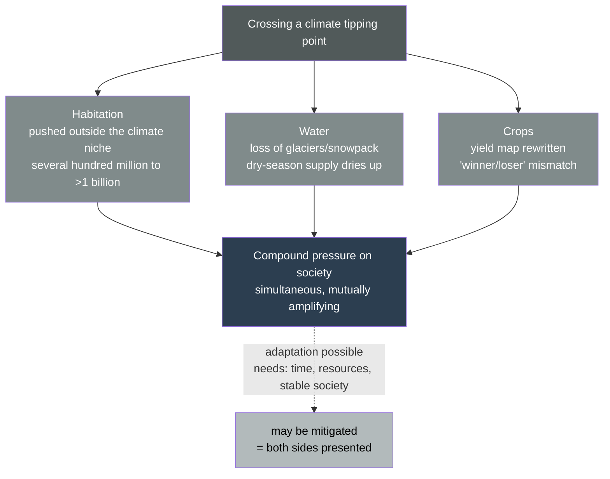

## 5.4 The counterargument from adaptation

Here, let us present both sides. 
This is an important honesty, to keep the book from falling into doomsaying.

Humanity has a capacity for adaptation. 
Developing heat- and drought-resistant crop varieties, advancing irrigation technology, desalinating seawater, shifting agriculture geographically, retrofitting urban infrastructure, spreading air conditioning. 
If these adaptation measures are deployed at sufficient speed, the damage can be greatly mitigated. 
Techno-optimism rejects pessimism on the grounds of this adaptive capacity. 
Humanity has, after all, overcome many environmental difficulties with technology, it argues.

This counterargument has a legitimate part. But adaptation has three conditions. 
**Time, resources, and a stable society.**

Deploying adaptation measures takes years. 
Developing and disseminating new crop varieties takes decades. 
Building desalination plants requires enormous funds. 
And above all, it requires a functioning government and a stable society that can plan and carry them out.

Yet if tipping points cascade rapidly, the environment changes before adaptation can catch up. 
Furthermore — as the next chapter shows — the very "stable society" that adaptation requires may begin to crumble under resource scarcity. 
The gap between countries that can adapt and countries with no margin even to try will widen.

## 5.5 Chapter summary

What this chapter confirmed is the physical consequences after crossing the irreversible line. 
The habitable climate niche shrinks, and several hundred million to over a billion people are pushed outside it. 
Water supplies dependent on glaciers and snowpack dry up. 
The crop-yield map is rewritten, and its "losers" overlap with populous regions. 
Adaptation is indeed possible, but it requires the conditions of time, resources, and a stable society — and it is exactly those conditions that come under threat.

Habitation narrows, water grows scarce, and the map of crops is rewritten. 
Each of these is serious on its own. 
But the real problem lies in how human society reacts when they occur all at once. 
History knows the answer. When resources run short, people often fight over them. 
In the next chapter, we look at that chain.

### References
- Lenton et al., "Quantifying the human cost of global warming," Nature Sustainability (2023): https://www.nature.com/articles/s41893-023-01132-6
- World Resources Institute, Aqueduct Water Risk Atlas: https://www.wri.org/aqueduct
- IPCC AR6, Working Group II "Impacts, Adaptation and Vulnerability" (2022): https://www.ipcc.ch/report/ar6/wg2/

 

---

# Chapter 6: When People Attack People

## 6.1 The chapter that must be written most carefully

This chapter must be written most carefully of any in the book.

The proposition "climate change causes war" becomes exaggeration if stated too strongly, and overlooks reality if stated too weakly. 
Single-line causation — temperatures rose, therefore there was war — is not scientifically supported. 
Conflict always arises from many factors intertwined: politics, economics, ethnicity, religion, governance failure. 
One cannot pull out climate alone and say "this is the cause."

That is precisely why security experts call climate change not a "cause" but a "threat multiplier." 
Climate change itself does not pull the trigger. 
It amplifies existing tensions, existing vulnerabilities, existing conflicts. 
Its role is not to set dry firewood alight, but to dry the firewood further. 
Something else may light the fire. 
But if the wood is dry, the same spark spreads in an entirely different way.

This framework is no longer the claim of environmental activists. 
It is a fact that national security agencies officially assess.

## 6.2 The chain that security agencies describe

U.S. intelligence agencies have concluded, in assessments based on classified information, that climate change could, over the coming decades, 
trigger political instability, mass refugee flows, terrorism, and conflict over water and resources. 
This is not an environmental-policy document but a national-security assessment document. 
An assessment of ecosystem collapse released by the UK government in January 2026 also showed how seriously security experts take this issue.

The structure of the chain described there is clear.

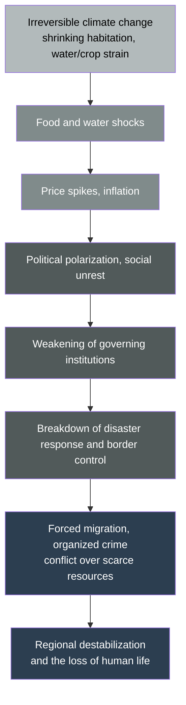

Food and water shocks spike prices; inflation breeds social unrest and political polarization; that weakens governing institutions; 
a weakened government can no longer handle disaster response and border control at the same time; 
and amid that breakdown, forced migration, organized crime, and conflict over scarce resources erupt, destabilizing the entire region. 
And in that process, human lives are lost. 
This is a single chain. The first link is climate; the last link is human life.

## 6.3 The buds already observed

This is not theory. 
Its buds are already observed in reality.

In Africa's Sahel region, aridification and desertification have squeezed farmland and pasture, and conflict over resources between farmers and herders has intensified. 
As water sources and arable land shrink, competition among those who use them grows fiercer. 
In some areas, such conflicts have produced death tolls ranging from thousands to over ten thousand per year. 
Climate is not the only cause. There is ethnic conflict, governance failure, the inflow of weapons. 
But that climate keeps drying the firewood that amplifies existing conflict is hard to deny.

The geopolitics of water already carries tension as well. 
India and Pakistan, which share the great rivers sourced in the Himalayas mentioned in the last chapter, both possess nuclear weapons and carry a long-standing rivalry. 
When that shared resource — water — destabilizes over the long term through glacial melt, what happens? 
An upstream nation controls the water; a downstream nation pushes back — this configuration can become a factor that raises tensions between nuclear-armed states. 
It is one of the scenarios security experts watch most warily.

The World Bank forecasts that internally displaced people due to climate change — so-called climate refugees — could arise on a massive scale by the middle of this century. 
When people are driven from their land, that movement brings new tensions into receiving regions. 
An inflow of refugees strains the receiving country's social safety net, drives political polarization, and strengthens xenophobia. 
Europe has already experienced a part of this.

## 6.4 Avoiding determinism

To repeat, this book does not depict these as a "settled future." 
Causation is multilayered, and uncertainty is large. 
There are many regions where climate change does not lead to conflict, and there are societies that succeed at adaptation. 
The single-line narrative of "climate → war → mass death" throws away the complexity of reality.

But as a structure, this much can be said. 
Irreversible climate change, through resource scarcity, shakes the foundation that supports social stability. 
And that shaking may, in the end, be paid for in the cost of human lives. 
Security agencies assess that possibility quietly, but seriously. 
They are not activists. They are sober experts whose profession is to prepare for the worst. 
That it is they who assess this as a threat is precisely what makes it weighty.

## 6.5 Chapter summary

What this chapter confirmed is the social and security consequences after crossing the irreversible line. 
Climate change is not the sole cause of conflict, but as a "threat multiplier" it amplifies existing conflict. 
The chain from food and water shocks, to inflation, political polarization, weakened governance, forced migration, resource conflict, 
and the loss of human life, is officially assessed by national security agencies. 
The conflict in the Sahel and the tension over water between India and Pakistan are its buds. 
Determinism must be avoided, but as a risk structure, this chain is seriously assessed.

Here we return to the book's first question. 
If consequences this serious are possible, why does the world not face them? 
Why do this timeline and these consequences not enter, as a calculation, into the decisions behind tens of trillions in investment? 
The answer is not on the side of the Earth. It is inside the human head.

### References
- U.S. National Intelligence Council, "Climate Change and International Responses Increasing Challenges to US National Security Through 2040" (NIE): https://www.dni.gov/files/ODNI/documents/assessments/NIE_Climate_Change_and_National_Security.pdf
- UK Government, Ecosystem collapse risk assessment (FOI release, 2026): https://www.gov.uk/government/publications
- World Bank, "Groundswell: Acting on Internal Climate Migration" (2021): https://openknowledge.worldbank.org/handle/10986/36248

 

---

# Chapter 7: Why Does No One Count the Stakes?

## 7.1 A brain that does not weigh threats equally

Let us now recover, as science, the quirk of human arithmetic touched on in the prologue.

The human brain does not weigh threats equally. 
The "nearer" a threat, the more "visible," the more "personal," the larger it is weighed. 
Conversely, the more "distant," "invisible," "probabilistic," and "diffuse in responsibility" a threat is, the more it is underestimated.

This is a product of evolution. 
For the ancestors of humanity who lived on the savanna, what mattered was the lion in front of them, tomorrow's food, tonight's safety. 
The individual who reacted instantly to the danger in front of it survived and left descendants, more than the one who worried about environmental change decades away. 
So our brains are built to be acutely sensitive to near threats and dull to distant ones. 
This is not a defect; it is a design that was once optimal.

## 7.2 Climate change, the "ideally underestimated threat"

Irreversible catastrophe from climate change satisfies every one of these conditions for being underestimated.

It is temporally distant. It looks like a matter of decades ahead. It is visually hard to see. 
CO2 is colorless and transparent; one cannot watch it increase with the naked eye. 
Its occurrence is probabilistic. "When," "where," and "to what degree" can be spoken of only within ranges of probability. 
And responsibility is diffused across the whole world; it belongs to no single person. 
Even if you alone change your behavior, the whole barely changes.

The psychologist Daniel Gilbert described climate change as "a nearly ideal threat that the human brain is not built to guard against." 
If climate change were something done by malicious humans, or something visibly against morality, humanity would have risen up long ago, he argued. 
The brain evolved to react to what pounces, more than to what creeps up.

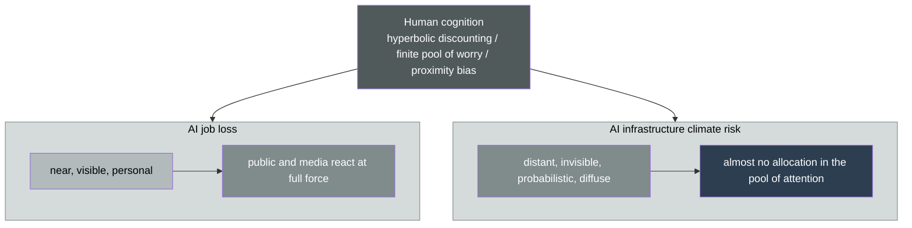

Behavioral economics has several concepts that back this up. 
Hyperbolic discounting — estimating future losses as excessively lighter than near ones. 
The finite pool of worry — there is a limit to how much one can worry at once, and when an immediate anxiety fills the pool, distant anxieties are shut out. 
Proximity bias — treating events temporally and spatially near as weightier than distant ones.

What happens when these combine? 
AI job loss — near, visible, personal — draws the full reaction of public opinion and media. 
Meanwhile, the irreversible climate risk that AI infrastructure's energy pushes up — distant, invisible, diffuse — is allocated almost no space in the pool of attention. 
Though both are "risks of AI," this asymmetry can be clearly observed in opinion polls and in the volume of media exposure.

In other words, the world does not count the stakes not because the world is foolish. 
**It is because human cognition is built to structurally underestimate long-term, invisible, probabilistic, diffuse threats.** 
Even the smartest people in the world are not free from this cognitive quirk. 
Rather, precisely because they are focused on the "near" contest of the AI race in front of them, the stakes on the distant timeline become invisible.

## 7.3 Answering three counterarguments

Here let us answer head-on the possible counterarguments to this book's thesis. 
An honest argument requires a response to the strongest objections.

**The first counterargument is that "AI's efficiency benefits exceed its emissions."** 
This is the IEA's "5% reduction potential" argument seen in Chapter 2. As a possibility, it holds. 
But there is no strong empirical consensus. 
The rebuttal to the "Jevons paradox" — the phenomenon in which the more efficiency rises, the more usage increases, so total consumption actually grows — has not been adequately made. 
In fact, Google reported in 2024 that operational improvements reduced its data centers' emissions intensity, 
yet in that same year, data centers' absolute electricity consumption rose 27% year on year. 
Intensity falls; absolute volume rises. This is the structural dilemma of AI energy. 
Efficiency does not reduce consumption; it justifies more of it.

**The second counterargument is that "data-center CO2 is 1% of the world's. You're making too much of it."** 
This book does not deny that 1% figure. 
But the book's point, as shown in Chapter 4, is not quantity but time. 
Not whether it is 1% or 2% of world emissions, but whether that emission becomes complicit, in the form of fossil fuels, in the few years of crossing the irreversible line. 
Even a small percentage, if it is added at the worst timing, in the position to topple the last domino, means something entirely different.

**Third, a counterargument to the book's framing itself — "saying 'no one notices' is an exaggeration. There are people discussing it."** 
This is correct. 
Climate scientists warn, security agencies assess, and some journalists report. 
"No one is discussing it" is, as a matter of fact, wrong.

But what this book points to is something else. Commentators exist. 
But they are fragmented. 
Those who discuss the scale of AI investment, those who discuss the climate's tipping points, and those who discuss the security chain are separate people. 
A vantage point that ties these four — AI infrastructure investment, climate irreversibility, security consequences, 
and human cognitive bias — together with a single line and integrates them as a "collision of timelines" is decisively lacking. 
The stakes are recorded, scattered here and there. 
But no one has assembled them into a single invoice. This book stands in that empty space.

## 7.4 Chapter summary

What this chapter confirmed is the cognitive reason humanity does not count these stakes. 
The human brain is built to be acutely sensitive to near, visible, personal threats and dull to distant, invisible, probabilistic, diffuse ones. 
Climate change is an "ideally underestimated threat" that satisfies all of the latter conditions. 
So AI job loss is fussed over, and AI infrastructure's climate risk is overlooked. 
This is not foolishness; it is the structure of cognition. 
And this book, after responding to the three counterarguments — the efficiency benefit, the 1% argument, and the "already discussed" argument — stands in the empty space where a vantage point integrating the four conversations is lacking.

### References
- Gilbert, D., "If only gay sex caused global warming," Los Angeles Times (2006): https://www.latimes.com/archives/la-xpm-2006-jul-02-op-gilbert2-story.html
- Weber, E. U., "Experience-based and description-based perceptions of long-term risk," Climatic Change (2006): https://link.springer.com/article/10.1007/s10584-006-9060-3
- Luccioni et al., "Power Hungry Processing: Watts Driving the Cost of AI Deployment?" arXiv 2311.16863: https://arxiv.org/abs/2311.16863

 

---

# Final Chapter: Make the Bet Visible

## The full picture of the bet

Having read this far, you already hold the answer to the first question.

"From tens of trillions of yen of AI infrastructure investment, how much CO2 comes out, and what does it bring to the planet?"

The answer is this. 
The absolute volume of CO2 is small, seen against the whole world. That is a fact. 
But the few years over which that emission accumulates overlap with the most dangerous few years, in which the Earth approaches its irreversible tipping point. 
And beyond that line lie consequences — shrinking habitation, struggles over water and crops, conflict, 
and the loss of human life — quietly recorded as the assessment of security agencies. 
And yet, humanity underestimates this long-term, invisible threat, because of the structure of cognition.

Let us, at the last, look back on the whole logic of the book in a single image.

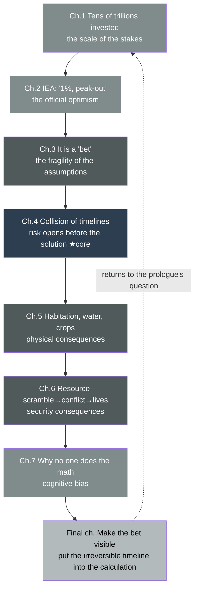

This is the full picture of the bet.

## Three irreversibilities

The structure this book has drawn has three "irreversibilities" overlapping. 
This is what makes the bet especially heavy.

**The first irreversibility is the irreversibility of infrastructure.** 
A natural-gas plant, once built, runs for decades and keeps emitting CO2. 
Fossil-fuel equipment built as a "bridge" is not easily removed. 
The moment an investment becomes a fixed asset, its emissions are reserved for decades.

**The second irreversibility is the irreversibility of the climate.** 
A climate system that has crossed a tipping point does not return on a human timescale. 
Melted ice sheets do not return, dead coral reefs do not return, a collapsed ocean circulation does not return. 
Even if you bring CO2 to zero, the line you crossed stays crossed.

**The third irreversibility is the irreversibility of human life.** 
Lives lost in resource conflict do not return. 
A generation's future, lost within a collapsed society, cannot be recovered.

These three irreversibilities overlap on the axis of time. 
That is the true weight of the "collision of timelines."

## What this book did not argue

This book does not say "stop AI." AI's benefits are real. 
AI can contribute to energy efficiency, to the development of decarbonization technology, to medicine, to education. 
I work as a specialist in AI strategy, and I believe in AI's possibilities more than anyone. This is not an anti-AI book.

Nor is this book a book of specific policy proposals. 
What the carbon tax should be set at, how nuclear should be accelerated, how renewable investment should be allocated 
— these particulars lie outside the book's scope. 
Each has its own experts and its own specialized debate.

The book's argument condenses to a single point.

**Put the "timeline" of the irreversible line into the calculation behind investment decisions.**

Right now, tens of trillions in investment decisions proceed on a premise that ignores time: "SMRs will eventually arrive in time," "renewables will eventually catch up." 
If that "eventually" is later than the Earth's tipping point, that investment becomes a bet complicit in fossil fuels at the worst possible timing. 
I do not say do not bet. But before you bet, count the stakes. Factor in what you stand to lose if you lose. 
That is the book's single demand.

## What lies beyond the structure

So who does that calculation?

It is the capitalists who invest in AI infrastructure, the governments who design policy, the companies who build data centers, and the media who report this issue. 
The responsibility to make the stakes visible and to build the irreversible timeline into decisions belongs to everyone taking part in this bet.

But to make that calculation possible, a particular kind of "eye" is required. 
An eye that crosses three domains — the "business" of AI infrastructure investment, the "technology" of climate and energy, and the "human understanding" of human cognition and social reaction — and ties them together with a single line. 
Because expertise is fragmented, the stakes stay scattered, and no one can assemble the invoice. 
What this book tried to do was to cross that fragmentation and write a single invoice.

I have systematized this crossing eye as a "BTC talent" integrating the three domains of Business, Technology, and Creative, 
and as "Depth & Velocity," a methodology for human–AI co-creation. 
The thinking framework for facing and calculating the "collision of timelines" this book has drawn lies on that same line.

---

Human beings are built to react to threats that pounce, more than to threats that creep up.

It was a rational evolution, for survival. 
On the savanna, the lion in front of you mattered more than the distant future.

But what humanity faces now is not the savanna's lion. 
It is a kind of threat that creeps up over decades and, the moment it crosses a certain line, can never be turned back. 
Against this threat, human cognition is, by design, defenseless.

That is exactly why calculation is needed. 
If intuition will not sound the alarm, then there is no choice but to lay the stakes on the table with numbers, with structure.

You now know the stakes of this bet. 
Knowing them, will you still keep pretending not to see? Or will you begin the calculation? 
That is for us — we who are living now — to decide.

### References
- Reiji Yamauchi, "Depth & Velocity: A New OS for Building Businesses in the Generative AI Era," Leading.AI (CC BY 4.0): https://github.com/Leading-AI-IO/depth-and-velocity
- Reiji Yamauchi, "The Orchestrator — The Rarest Role in the AI Era," Leading.AI (CC BY 4.0): https://github.com/Leading-AI-IO/the-orchestrator-in-the-ai-era

 

---

*This book integrates the Deep Research outputs of three engines — ChatGPT, Claude, and Gemini — and is structured on primary sources including the IEA's "Energy and AI," LBNL's "Queued Up 2025," the WMO's annual-to-decadal climate outlook, the Global Tipping Points Report 2025, national security assessments, and corporate earnings disclosures. Figures are as published at the time of writing and should be updated as the assumptions of the scenarios — especially the progress of SMRs, grids, and renewables — change.*

*Leading.AI / CC BY 4.0*
