# AIは地球を壊すのか

### 数十兆円のインフラ投資と、気候の「不可逆ライン」
**Will AI Break the Planet? — The AI Infrastructure Boom and the Race Against the Climate's Point of No Return**

 

---

# 序章: 飛ばされた計算

## 人間が持つ、奇妙な計算の癖

人間には、奇妙な計算の癖がある。

目の前にある脅威は、実際より大きく見える。遠くにある脅威は、実際より小さく見える。 
すぐに痛みを伴う危険には全力で身構えるが、ゆっくりと、しかし確実に近づいてくる危険には、なぜか手を打たない。

行動経済学はこれを「双曲割引（hyperbolic discounting）」と呼ぶ。 
未来の価値を、時間的な距離に応じて急激に割り引いてしまう傾向だ。 
明日もらえる1万円と、1年後にもらえる1万2千円を比べたとき、多くの人は明日の1万円を選ぶ。 
利率にすれば年20%という破格の条件を、人は「遠い」というだけで手放す。

心理学者は、別の言葉も持っている。「有限の懸念プール（finite pool of worry）」——  
人間が同時に心配できる感情の総量には上限があり、目の前の不安がその枠を占めると、遠くの不安は自動的に押し出される。 
生活費の心配で頭がいっぱいのとき、人は数十年後の気候のことを考える余裕を持てない。 
これは意志の弱さではなく、認知の構造的な制約だ。

この二つの癖が、いま、人類史上最大級の意思決定の場で、同時に作動している。

## 2026年、人々が騒いでいるもの

2026年、AIは社会の中心議題になった。 
とりわけ激しく語られているのは「雇用」だ。

AIに仕事を奪われる。エントリーレベルの職が消える。新卒が職に就けない。ホワイトカラーの中間層が崩れる。 
これらの議論は、メディアを埋め尽くし、SNSで拡散され、政治家の演説に登場し、家庭の食卓で語られる。

これは当然のことだ。雇用の喪失は、直近で、可視で、個人的な脅威だからだ。 
来月の給料、来年のキャリア、子どもの就職——どれも、手で触れられるほど近い。 
人間の認知は、こうした近い脅威に対して、正しく、激しく反応するようにできている。

その一方で、ほとんど誰も賭け金を数えていない問いがある。

**世界中のAI企業と資本と政府とメディアが、数十兆円規模のAIインフラ投資に注力している。**  
**その膨大な電力供給を実現する過程で、いったいどれだけのCO2が排出され、**  
**それは地球に、そして人類に、最終的に何をもたらすのか。**

この問いは、長期で、不可視で、確率的で、責任が拡散している。 
だから、人間の認知の癖は、これを構造的に過小評価する。 
雇用喪失に注がれる世論の熱量と、この問いに向けられる関心の薄さの差は、驚くほど大きい。

本書は、その薄さを問題にする。

## 本書が立つ位置

本書の立場を、最初に明確にしておく。

本書は「AIが地球を滅ぼす」という終末論ではない。AIの便益を否定する本でもない。むしろ逆だ。 
本書は、この問題について語られる最も権威ある公式見解——国際エネルギー機関（IEA）の、 
「データセンターのCO2は世界排出の1%程度にすぎず、2030年頃にピークアウトする」という、比較的楽観的な予測——を、 
楽観視せず、正面から受け止めることから始める。

なぜなら、その公式の楽観こそが、最も注意深く読まれるべきだからだ。

IEAの数字は正しい。 
データセンターのCO2は、絶対量で見れば、世界全体の中では小さい。これは事実だ。 
本書はこの事実を否定しない。否定する必要もない。

だが、本書が問うのは「量」ではない。 
**「方向」と「時間」だ。**

第一に、その「ピークアウト」という予測は、ある重大な前提の上に成り立っている。 
小型モジュール炉（SMR）、新規原子力、送電網の拡張、再生可能エネルギーの加速 
——これら「まだ実現していない技術と設備」が、予定通りに間に合う、という前提だ。 
予測ではなく、賭けである。

第二に、その賭けが「間に合う」とされる時間軸は、 
地球の気候が不可逆な臨界点（ティッピングポイント）を越えるリスクが急騰する時間軸と、重なっている。 
低排出電源が間に合う頃には、もう手遅れかもしれない。

第三に、不可逆ラインを越えた先に待つもの 
——居住可能な土地の縮小、水と作物をめぐる争奪、紛争、そして大量の人命の喪失—— 
を、人類は、雇用喪失のような直近の脅威に比べて、構造的に過小評価している。

## 四つの分断された議論

本書が試みるのは、これまで別々に語られてきた四つの議論を、一本の線でつなぐことだ。

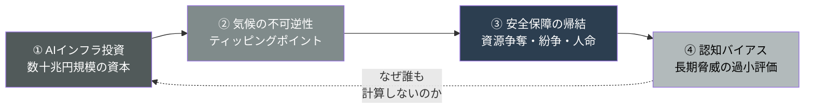

AI投資の規模を論じる経済アナリストがいる。 
気候のティッピングポイントを論じる気候科学者がいる。 
資源紛争を論じる安全保障の専門家がいる。 
そして、人間の認知バイアスを論じる行動経済学者がいる。 
それぞれが、それぞれの領域で、正確に語っている。

だが、この四つを一本の線でつなぎ、 
「AIインフラ投資が、気候の不可逆ラインと、時間軸の上で衝突している」という一つの構造として統合した視座は、決定的に不足している。 
賭け金は、あちこちに散らばって記録されている。だが、誰もそれを一枚の請求書にまとめていない。

本書が立つのは、その空白だ。

世界で最も賢い人々が、最も重要な計算を飛ばしている。 
その飛ばされた計算を、これから一つずつ、机の上に並べていく。

それでは、まず規模から見ていこう。 
賭け金がどれほど巨大かを知らなければ、賭けの重さは分からない。

## 注記

本書の数値は、すべて公表時点の一次情報に基づく。 
IEA「Energy and AI」、LBNL「Queued Up」、WMOの年次気候見通し、Global Tipping Points Report、各国の安全保障評価、および各社の決算開示等を出典とする。 
各章末に参考文献URLを明記した。 
シナリオの前提（特にSMR・送電網・再エネの進捗）の変化に応じて、数値は更新されるべきものである。

### 参考文献
- IEA, "Energy and AI" (2025): https://www.iea.org/reports/energy-and-ai
- Carbon Brief, "AI: Five charts that put data-centre energy use – and emissions – into context" (2025): https://www.carbonbrief.org/ai-five-charts-that-put-data-centre-energy-use-and-emissions-into-context/

 

---

# 第1章: 異次元の投資

## 1.1 数十兆円が動く現実

数字から始める。 
実感のない議論は、実感のない結論しか生まないからだ。

2025年、世界の主要テクノロジー企業は、AIインフラに向けて、人類が単一産業に投じたことのない規模の資本を投下した。 
各社の決算開示から、設備投資（CapEx）の実額を拾ってみる。

Microsoftの2025会計年度の設備・資産投資は約646億ドル。前年度の約445億ドルから、およそ45%増。 
Alphabet（Google）の2025年の設備投資は約914億ドル、前年の約525億ドルから約74%増。 
Amazonの2025年の設備・資産購入は約1,283億ドル、前年の約777億ドルから約65%増。 
Metaの2025年の設備投資は約722億ドル。

この4社だけで、2025年の実績は合計約3,565億ドルに達する。 
日本円にして、およそ55兆円。一企業群の、一年間の、設備投資だけの数字だ。 
日本の国家予算の一般会計が110兆円規模であることを思えば、その半分に相当する金額を、わずか4社が一年でインフラに注いだことになる。

そして、これは助走にすぎない。

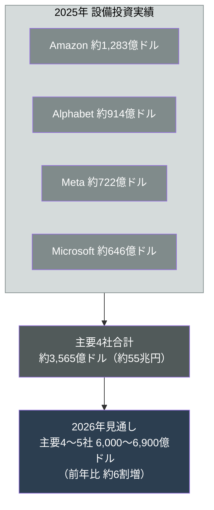

IEAは、最大手テクノロジー企業群の設備投資が2025年に4,000億ドルを超え、2026年にはさらに75%増加すると見込んでいる。 
各社の2026年ガイダンスを積み上げると、主要4〜5社の合計は6,000億ドルから6,900億ドルに達する見通しだ。 
前年比でおよそ6割の増加である。

## 1.2 石油を超えた資本

この投資規模の異常さを、IEAはひとつの比較で示している。

**これら巨大テック企業の設備投資は、いまや石油・天然ガスの生産に向けられる世界全体の投資を上回る。**

これは、文明のエネルギーの重心が移動していることを意味する。 
20世紀の人類は、地中から化石燃料を掘り出すことに最大の資本を投じてきた。 
それが、産業を動かし、都市を照らし、経済を回す前提だった。 
だが2026年、人類は、地中からエネルギーを掘り出すために使う金より、AIの計算能力を建てるために使う金のほうを多く使っている。

計算は、新しい石油になった。 
だが、その計算を動かすには、結局のところ、膨大な電力が要る。 
そして電力は、いまだに、その多くを化石燃料に依存している。 
ここに、本書が解剖する循環の出発点がある。 
AIという「新しいエネルギー消費」が、「古いエネルギー源」への依存を、むしろ強めているのだ。

## 1.3 投資の物理的な姿

この数十兆円は、どこへ向かうのか。 
物理的な姿を見ておこう。

その大半は、データセンターになる。 
サーバー、GPU、冷却設備、そして電力を引き込むための変電所と送電線。 
抽象的な「投資」は、最終的に、地面に建つ巨大な建物と、そこへ電気を送る物理的なインフラに変わる。

象徴的なのが、OpenAIが主導する「Stargate」構想だ。 
目標とする電力規模は10ギガワット。 
米国の平均的な世帯の年間電力消費を基準にすると、およそ750万から1,000万世帯分に相当する。 
一つのデータセンター構想が、一つの国の主要都市圏に匹敵する電力を要求する。

その旗艦施設であるテキサス州アビリーンのキャンパスは、 
全棟が稼働すると約1.2ギガワット、およそ75万世帯分を消費し、最大45万基のGPUを展開する計画だ。 
2025年末時点で、約4,500億ドルの投資がコミットされている。

電力という抽象的な数字は、やがて土地と住民との具体的な摩擦になる。 
ミシガン州に建設されるStargate施設は、単体で約1.4ギガワットを消費する計画だが、 
地元の住民投票で4対1の反対を押し切って建設が進められた。 
周辺の19の市町村が、新規データセンター開発の一時停止条例を制定する事態を招いている。 
電力の奪い合いは、すでに、抽象的な未来予測ではなく、地域社会の現実の対立になっている。

## 1.4 賭けの資金源

そして、この投資の異常さは、資金の出どころにも表れている。

かつて巨大テック企業は、潤沢な現金を抱える企業の代名詞だった。 
広告や課金で稼いだ莫大なキャッシュを使い、自己資金で投資する。それが彼らの強さだった。 
だが、いまや設備投資額は自社の営業キャッシュフローを上回り始め、 
外部からの借入——レバレッジ——に依存するモデルへと移行しつつある。

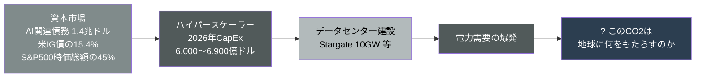

報道集計によれば、AI関連の債務は過去最高の1.4兆ドルに達し、 
米国の投資適格債（信用力の高い社債）の15.4%を占める最大セグメントになった。 
ハイパースケーラー5社が2025年に発行した米社債は1,210億ドルで、2020〜2024年の年平均280億ドルの4倍を超える。 
さらに、ゴールドマン・サックスの分析では、AI関連株はS&P500の時価総額の約45%を占めるに至っている。 
2022年11月のChatGPT公開時の約25%から、ほぼ倍だ。

これが意味するのは、AIインフラ投資が、もはやテック業界の内部の話ではないということだ。 
世界の金融市場の中核に、AIインフラという巨大な賭けが組み込まれている。 
年金基金が買う投資適格債の一部も、私たちが保有する株式インデックスの大きな部分も、この賭けに連動している。 
気候への配慮よりも、インフラの物理的構築のほうが、圧倒的に優先して資金を供給されているのが、2026年の現実だ。

## 1.5 本章のまとめ

本章で確認したのは、賭け金の規模である。 
主要4社だけで年間55兆円、2026年には主要数社で6,000億ドルを超えるAIインフラ投資が動き、それは石油・天然ガス生産への世界投資を上回る。 
資金はもはや自己資金では足りず、世界の金融市場の中核を占める債務と株式に組み込まれている。 
そしてその投資は、最終的に、一国の都市圏に匹敵する電力を要求するデータセンターに変わる。

これだけの規模なら、CO2もさぞ大変なことになるのではないか——そう考えるのが自然だ。 
だが、ここで意外な事実に直面する。公式機関は、そうは言っていないのだ。 
次章で、その公式の見解を、最も誠実な形で受け止める。

### 参考文献
- Microsoft, FY2025 Annual Report: https://www.microsoft.com/investor/reports/ar25/index.html
- IEA, "Key Questions on Energy and AI" (2025): https://www.iea.org/reports/key-questions-on-energy-and-ai
- IEA, "Energy and AI" (2025): https://www.iea.org/reports/energy-and-ai

 

---

# 第2章: 公式の楽観

## 2.1 IEAは「大丈夫」と言っている

国際エネルギー機関（IEA）は、エネルギーに関する世界で最も権威ある分析機関の一つだ。 
各国政府がエネルギー政策を立てる際の基準となるデータを提供してきた。 
そのIEAが2025年に初めて、AIとエネルギーの関係を正面から扱った報告書「Energy and AI」を発表した。

その内容は、多くの人の直感に反して、かなり落ち着いている。

データセンターの電力消費は、2024年に約415テラワット時（TWh）だった。 
IEAの中心シナリオ（Base Case）では、これが2030年に約945TWhへと倍増以上に増える。 
2030年のこの水準は、現在の日本一国の総電力消費に匹敵する。 
さらに2035年には約1,200TWhに達する。

電力消費は、確かに爆発的に増える。だが、ここからが重要だ。 
**電力消費が倍増しても、IEAはCO2が破局的に増えるとは見ていない。**

## 2.2 ピークアウトという予測

データセンターの電力起因のCO2排出を、IEAの中心シナリオで追ってみる。

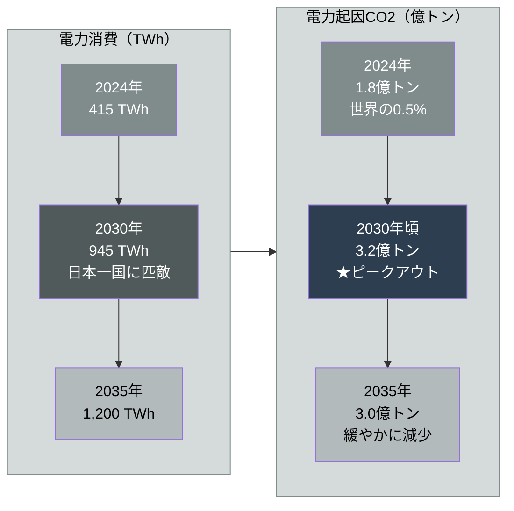

電力起因のCO2排出は、2024年に約1.8億トン。 
IEAの中心シナリオでは、これが2030年頃に約3.2億トンでピークを迎え、 
その後2035年には約3.0億トンへと、むしろ緩やかに減少していく。

この数字を、世界全体の中に置いてみよう。 
2024年の世界のCO2排出量は約416億トンと推計される。 
データセンターの電力起因排出はその約0.5%にすぎない。 
IEAの予測では、2030年時点でもデータセンターが世界のCO2排出に占める割合は、中心シナリオで約1%、高成長シナリオでも約1.4%にとどまる。 
2035年でも、エネルギー部門全体の排出の1.5%未満だ。

「電力消費は倍増する。だがCO2は1%程度で、しかもピークアウトする」——これがIEAの骨子である。

なぜ、消費が倍増するのにCO2はピークアウトするのか。 
IEAの論理はこうだ。電力消費そのものは増える。 
しかし、その電力を供給する電源が、石炭や天然ガスから、再生可能エネルギーと原子力へと移っていく。 
だから、消費量あたりのCO2（炭素強度）が下がり、総排出量はある時点で頭打ちになって、減少に転じる、と。

## 2.3 楽観論の最強版

そして、IEAはさらに踏み込んだ「楽観論の最強版」を提示している。 
これは、本書が後の章で反論する相手だからこそ、最も強い形で紹介しておかねばならない。

AIは電力を消費するだけではない。 
AIを使えば、電力網の運用を効率化し、エネルギーの無駄を減らし、脱炭素技術の開発を加速できる。 
送電網の需給を最適化し、再エネの出力変動を予測し、産業プロセスのエネルギー効率を高める。 
IEAは、すでに利用可能なAIの応用を電力・エネルギー部門に広く実装するだけで、 
2035年にエネルギー関連排出の約5%に相当する削減余地があると試算している。

これは無視できない主張だ。 
データセンター自身の排出が世界の約1%であるのに対し、AIがもたらす削減効果がエネルギー部門排出の5%相当になりうるのなら、 
**差し引きでAIは気候にとってプラスになる**——そういう議論すら成り立つ。 
「AIは電気を食う悪者だ」という素朴な批判は、この一点で簡単に論破されてしまう。

加えてIEAは、軽量なAIの利用なら電力負荷は小さいことも示している。 
たとえば従来の検索を単純なAI検索に全面的に置き換えても、追加の電力需要は年間4TWh未満にすぎない、という試算だ。 
日常的なAIの利用が、ただちに地球を焦がすわけではない。

## 2.4 本章のまとめ

本章で確認したのは、公式の楽観の中身である。 
データセンターのCO2は、世界全体では約1%と小さい。 
中心シナリオではピークアウトする見通しだ。 
しかもAIは、エネルギー部門の効率化を通じて、自らの排出を上回る削減に貢献しうる。 
権威ある国際機関が、データに基づいて、そう言っている。

ならば、本書の問いは杞憂なのだろうか。 
「数十兆円のインフラ投資で、どれだけのCO2が出るのか」——答えは「世界全体から見れば、わずか」。 
それで話は終わりなのか。

終わらない。 
なぜなら、この美しい楽観のシナリオには、本文に小さく、しかし決定的に書き込まれた一語があるからだ。 
「もし、低排出電源が、間に合えば」。 
次章で、その一語を解剖する。

### 参考文献
- IEA, "Energy and AI — Executive Summary" (2025): https://www.iea.org/reports/energy-and-ai/executive-summary
- IEA, "Energy and AI — AI and Climate Change" (2025): https://www.iea.org/reports/energy-and-ai/ai-and-climate-change
- IEA, "Global data centre CO2 emissions, Base Case, 2020-2035": https://www.iea.org/data-and-statistics/charts/global-data-centre-co2-emissions-base-case-2020-2035

 

---

# 第3章: 賭けの正体

## 3.1 ピークアウトが依存する三つの前提

前章で見たIEAのピークアウト予測は、自動的に実現する見通しではない。 
IEA自身が、その実現が複数の条件に依存していることを、報告書の中で明記している。

条件はこうだ。 
2035年までに増える電力需要のうち、そのほぼ半分を再生可能エネルギーで賄う。 
データセンター向け電力に占める再エネ比率を、現在の約27%から2035年には約50%へ引き上げる。 
そして2030年以降、小型モジュール炉（SMR）が低排出のベースロード電源として供給に加わる。 
これらが「同時に、予定通りに」達成されることが、ピークアウトの前提だ。

逆に言えば、IEAは、2030年までは追加需要の40%超を天然ガスと石炭が供給すると明記している。 
低炭素電源が間に合うまでの「つなぎ」は、化石燃料なのだ。

つまり構造はこうだ。
**ピークアウトのカーブは、低排出電源が予定通りに立ち上がることを前提に描かれている。**  
**その立ち上がりが遅れれば、化石燃料での穴埋めが長期化し、CO2のピークは後ろへずれる。**

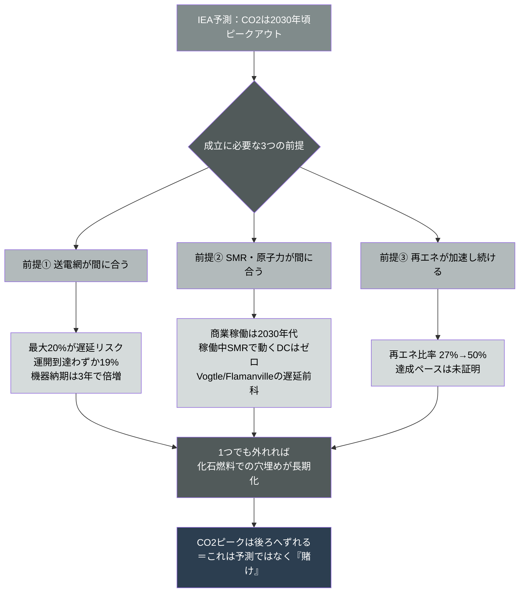

では、その前提——送電網、SMR・原子力、再エネ——は、どれほど堅いのか。 
一つずつ、一次情報で確かめていく。

## 3.2 送電網: 最大のボトルネック

IEA自身が、最も率直に警告しているのが送電網だ。 
IEAは、電力網の制約に抜本的な対応がなされなければ、 
計画中のデータセンタープロジェクトの最大20%が遅延しうると述べている。

この警告は、米国の実データで裏付けられる。 
ローレンス・バークレー国立研究所（LBNL）の「Queued Up」報告によれば、 
米国で系統接続を待つ発電・蓄電プロジェクトは、2024年末時点で発電容量1,400ギガワット＋蓄電890ギガワット、合計約2,290ギガワット。 
これは米国の既存発電設備の約2倍に相当する量が、接続を待って列に並んでいるということだ。

そして、その列は遅々として進まない。 
2024年に商業運転に到達したプロジェクトが列に並んでいた期間は、平均で約55ヶ月——4年半。 
さらに深刻なのは、申請したプロジェクトのうち実際に運転開始に至るのは、歴史的に約19%にすぎないという事実だ。 
残りの大半は、長い待機の末に撤退していく。

注意すべき点がある。 
最新の2025年末のデータでは、接続待ち容量は約2,060ギガワットへと、前年比で約12%減少した。 
だが、これを「制約が緩和された」と読むのは誤りだ。 
減少の主因は、新規申請の減少と、歴史的な規模の撤退である。 
2024年には約500ギガワットの新規申請に対し、約700ギガワットが列から撤退した。 
列が短くなったのは、道が広がったからではなく、多くのプロジェクトが諦めたからだ。

加えて、送電網を物理的に作るための部品も足りない。 
IEAによれば、変圧器やケーブルといった重要機器の納入待ち期間は、この3年でほぼ倍増した。 
送電線そのものの建設には4〜8年を要する。 
「欲しい場所に、欲しい時期に、欲しいだけ電力をつなぐ」ことは、もはや当たり前ではない。 
データセンターは1〜2年で建つが、それに電気を送る送電網は、その数倍の時間を要する。 
この時間差が、化石燃料での「その場しのぎ」を長期化させる。

## 3.3 SMR・原子力: まだ動いていない切り札

24時間365日の安定した低炭素電源として、 
ハイパースケーラーが期待を寄せているのが原子力、とりわけSMR（小型モジュール炉）だ。

期待の規模は確かに大きい。 
IEAによれば、データセンター事業者とSMRの条件付き調達契約のパイプラインは、2024年末の25ギガワットから45ギガワットへと拡大した。 
MicrosoftはConstellation社と、スリーマイルアイランド原発1号機 
（約835メガワット、クレーン・クリーン・エネルギー・センターに改称）の再稼働に向けた20年間の電力購入契約を結んでいる。 
Amazon、Googleも、相次いでSMR開発企業との契約を発表している。

だが、契約は電力ではない。 
実際に発電して初めて、電力になる。

ここに、賭けの核心がある。 
**SMRの商業稼働は2030年代だ。**  
**そして現時点で、稼働しているSMRで電力を得ているデータセンターは、世界に一つも存在しない。**  
大型の新規原子力に至っては、開発と建設に5〜10年を要する。

歴史は、原子力プロジェクトが計画通りに進まないことを、繰り返し示してきた。 
米国ジョージア州のボーグル原発3・4号機は、当初約140億ドルとされた建設費が、最終的に300億ドルを超えた。完成も大幅に遅れた。 
フランスのフラマンビル3号機は、約237億ユーロのコストと、12年もの遅延に苦しんだ。 
原子力は、約束の時期に、約束のコストで現れたことが、ほとんどない。

SMRが2030年代に予定通り立ち上がる——これは、過去の実績に照らせば、相当に楽観的な仮定だ。 
そして、立ち上がるまでの間、その穴を埋めるのは、IEA自身が認める通り、天然ガスである。 
実際、米国ではガスタービンの受注が136ギガワット規模に達し、ここ25年で最高水準を記録している。 
「つなぎ」のはずの化石燃料が、長期の固定設備として地面に打ち込まれつつある。 
一度建てたガス火力発電所は、数十年にわたって稼働し、CO2を出し続ける。

## 3.4 揺れるCO2の数字

ここまでは「前提が間に合うか」という話だった。 
だが、もう一段深い問題がある。 
前章で見たIEAの「世界排出の0.5%」という数字自体が、何を測っているかによって大きく変わるのだ。

IEAの1.8億トンという数字は、データセンターが消費する電力の発電に伴う「間接排出」を指している。 
だが、これはデータセンターの環境負荷の全体ではない。

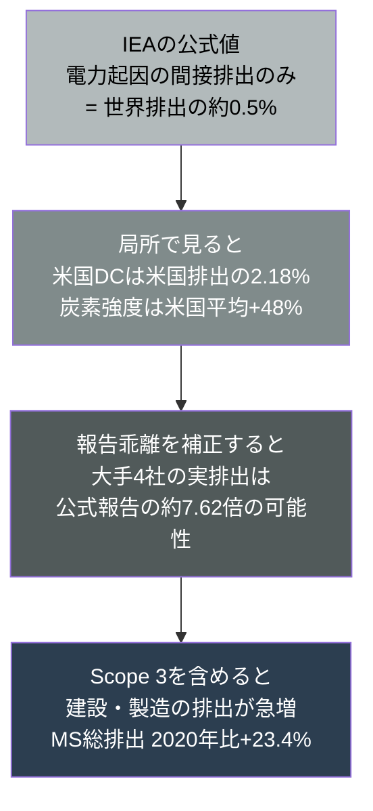

独立した研究は、別の像を描く。 
2023年9月から2024年8月にかけて米国のデータセンター2,132施設を調査した研究によれば、 
これらの施設は米国の電力消費の4%超を占め、その電力の56%が化石燃料由来で、1億500万トン超のCO2換算排出を生んでいた。 
これは2023年の米国排出の2.18%に相当する。 
さらに、データセンターの炭素強度——消費電力あたりのCO2——は、米国平均を48%も上回っていた。 
立地が化石燃料の多い地域に偏っているためだ。

「世界の0.5%」と「米国の2.18%」。 
この差は、母数の違い（世界か米国か）だけではない。 
局所への集中という、平均値が隠してしまう構造を映している。 
データセンターは世界に均等に散らばっているのではなく、特定の地域に密集する。 
その地域の電力網に、その地域の住民と競合する形で、負荷をかける。

さらに、企業の自己報告そのものへの疑義もある。 
ガーディアン紙の分析によれば、2020年から2022年にかけて、 
Google・Microsoft・Meta・Appleの実際の排出は、公式に報告された値の約7.62倍だった可能性がある。 
再生可能エネルギー証書（REC）による相殺を差し引く前の「素の排出」を見れば、像はまったく異なる。 
建設に伴うセメントや鉄鋼、ハードウェア製造のサプライチェーン全体の排出（Scope 3）は、各社とも劇的に増加している。 
Microsoftの2025年の報告では、総排出（Scope 1・2・3）は2020年比で23.4%増えた。 
同社のエネルギー使用量はこの間168%増加している。

## 3.5 本章のまとめ

本章で確認したのは、公式の楽観が立つ土台の脆さである。 
IEAの「1%・ピークアウト」は、間違いではない。 
だが、それは(1)送電網が間に合い、(2)SMRと原子力が間に合い、(3)再エネが減速せず加速する——という三つの「間に合えば」の上に立つ、条件付きのシナリオだ。 
そのいずれもが、IEA自身が認めるボトルネックを抱え、過去の実績に照らせば遅延のリスクが高い。 
そして、測られているCO2の数字自体が、間接排出のみを見るか、局所集中・Scope 3・報告乖離まで見るかで、大きく姿を変える。

これは予測ではない。賭けだ。そして、賭けには時間がかかる。 
SMRが立ち上がるまで、送電網が整うまで、待たねばならない。 
問題は、待っている間に、別の時計が進んでいることだ。地球の時計である。 
次章で、その二つの時計を重ね合わせる。

### 参考文献
- IEA, "Energy and AI — AI and Climate Change" (2025): https://www.iea.org/reports/energy-and-ai/ai-and-climate-change
- LBNL, "Queued Up: 2025 Edition" (2025): https://emp.lbl.gov/queues
- IEA, "The Path to a New Era for Nuclear Energy" (2025): https://www.iea.org/reports/the-path-to-a-new-era-for-nuclear-energy
- "Environmental Burden of United States Data Centers in the AI Era," arXiv 2411.09786 (2024): https://arxiv.org/pdf/2411.09786
- Data Centre Magazine, "What is the Truth About Future AI & Data Centre Emissions?" (2025): https://datacentremagazine.com/news/what-is-the-truth-about-future-ai-data-centre-emissions

 

---

# 第4章: 時間軸の衝突

## 4.1 地球には、後戻りできない一線がある

地球の気候には、後戻りできない一線がある。

科学者はこれを「ティッピングポイント（臨界点）」と呼ぶ。 
ある閾値を超えると、システムが自己強化的に暴走し、元の状態に戻れなくなる点だ。 
坂道を転がり始めた岩は、ある勾配を超えると、もう手で押さえても止まらない。 
気候システムにも、それと同じ構造の臨界点が、複数存在する。

グリーンランドの氷床、西南極の氷床、大西洋の海洋循環（AMOC）、アマゾンの熱帯雨林、 
永久凍土、暖水サンゴ礁、北方林——これらはいずれも、ティッピング要素として知られている。 
たとえばグリーンランドの氷床がある閾値を超えて融解を始めると、標高が下がって表面の気温が上がり、それがさらに融解を加速する。 
この自己強化のループに入ると、人類がどれだけCO2を減らしても、融解は止まらなくなる。 
「不可逆」とは、そういう意味だ。

かつて、これらの臨界点は「数℃の温暖化が進んだ、遠い未来の話」とされていた。 
だが、科学的理解は、この数年で急速に厳しい方向へ更新されている。

## 4.2 臨界点は、思ったより近い

2023年から2025年にかけて発表された一連の研究は、衝撃的な結論を示した。

1.5℃未満の温暖化でも、最大で8つのティッピングポイントに到達しうる。 
かつて「2℃や3℃で起きる遠い話」とされていたものが、 
パリ協定が死守しようとしている1.5℃のラインの、その手前で起こりうると分かってきたのだ。

そして、すでに現実が動いている。 
「Global Tipping Points Report 2025」は、暖水のサンゴ礁が約1.2℃で臨界を越え、 
現在の約1.4℃の水準で、地球規模のティッピングポイントを越えた最初の生態系になりつつあると報告した。 
サンゴ礁は、海洋生態系の基盤であり、それに依存する数億人の漁業と沿岸防護を支えている。 
その最初のドミノが、すでに倒れ始めている。

「不可逆」は、比喩ではない。 
科学用語として、正確にそう言われている。 
そして、その一線は、私たちが思っていたよりもずっと近い。

## 4.3 二つの時計

ここで、本書の核心に入る。二つの時計を並べてみる。

**第一の時計——「解決策が間に合う時間軸」。** 
第3章で見た通り、ピークアウトを支えるSMRの本格的な寄与は2030年以降。 
大型原子力の新設・再稼働も2028〜2029年以降が中心。 
送電網の整備には数年から十年。 
つまり、低排出電源がデータセンターの需要を十分にカバーできるようになるのは、早くても2030年代だ。

**第二の時計——「不可逆ラインを越える時間軸」。** 
世界気象機関（WMO）は2026年の見通しで、 
2026年から2030年の少なくとも1年が、1.5℃を一時的に超過する確率を91%とした。 
前年の見通しでは、2025〜2029年の5年平均が1.5℃を超える確率を70%としていた。 
確率は、年々上方に修正されている。 
地球の時計は、予想より速く進んでいる。

この二つの時計を重ねると、何が見えるか。

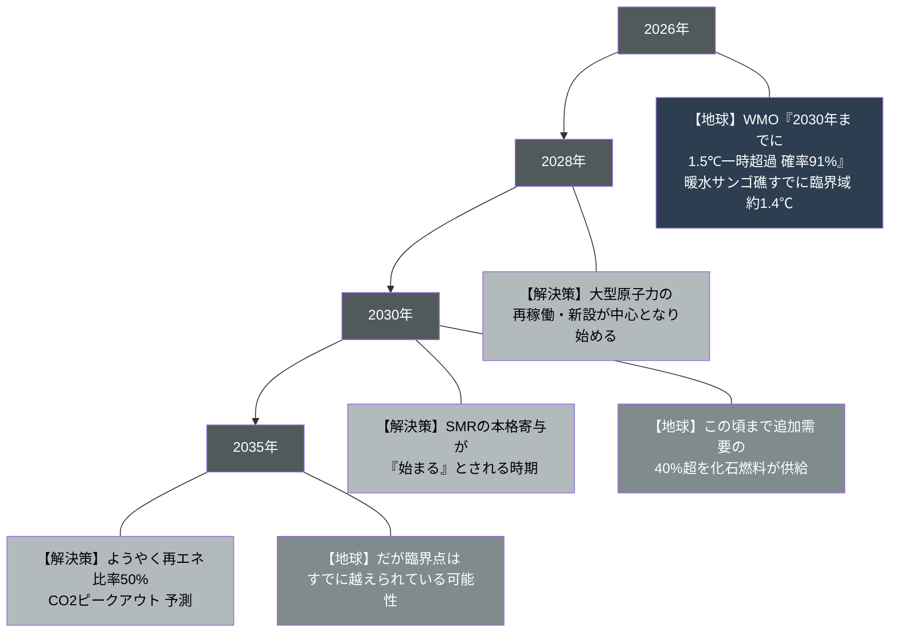

**低排出電源が「間に合う」とされる年と、地球が不可逆の臨界リスクに突入する年が、重なっている。**

人類が新しいクリーンエネルギー技術の実装を待っている、まさにその数年の間に、気候システムは不可逆の一線に近づいていく。 
低排出電源がようやく間に合った頃には、少なくともいくつかのティッピングポイントは、すでに越えられているかもしれない。

## 4.4 衝突の構造

この衝突を、もう一段抽象化して示す。 
問題は、二つの時計の速度が違うことだ。

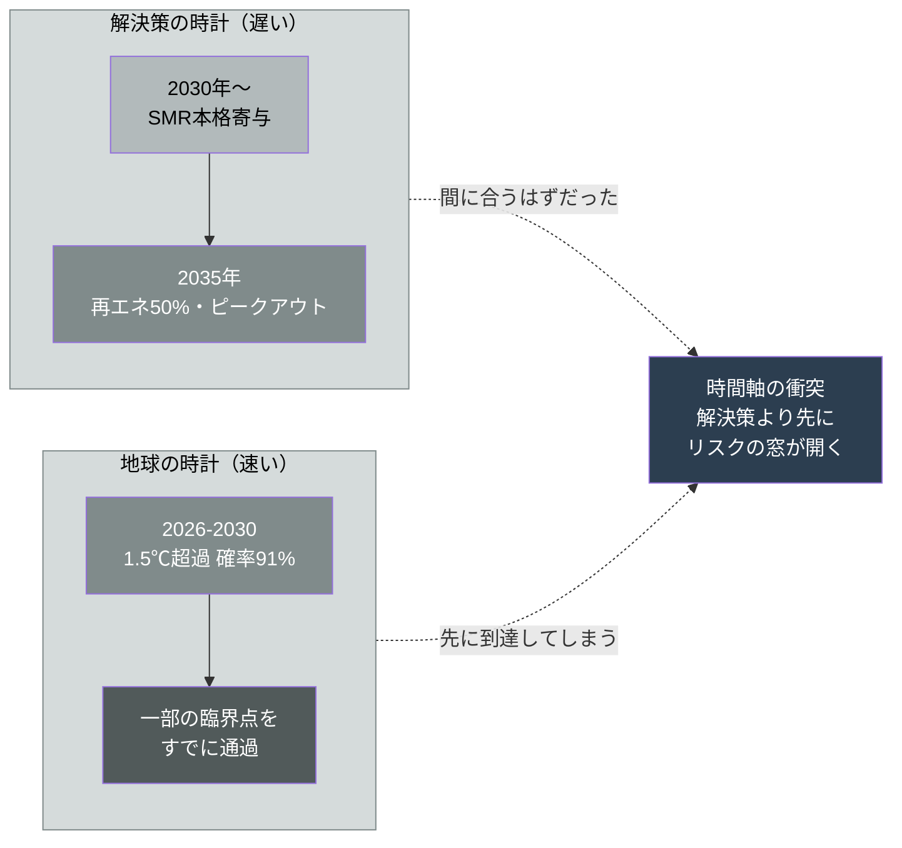

第1章で見た数十兆円の投資は、この時間の問題を、まったく計算に入れていない。 
投資の意思決定は、SMRが「いずれ間に合う」という前提で進む。 
だが「いずれ」が地球の臨界点より後なら、その投資は、不可逆ラインを越える過程に、化石燃料という形で加担することになる。

電力需要は「いま」発生する。データセンターは「いま」建つ。 
だが、それを賄う低炭素電源は「後で」来る。 
その時間差を埋めるのは、天然ガスと石炭だ。 
そして、その「つなぎ」の期間に排出されるCO2が、最も危険なタイミング——不可逆ラインに近づく数年間——に上乗せされる。

## 4.5 量ではなく、時間の問題

ここで、慎重に言葉を選ぶ必要がある。

本書は「何年何月に、確実に不可逆ラインを越える」とは言わない。 
気候科学は、そのような断定をしない。 
ティッピングポイントは、確率と、閾値と、幅をもって語られる。 
「2030年に必ず破局が来る」と書いた瞬間、それは終末論になり、科学から離れる。

本書が言うのは、もっと構造的なことだ。 
**リスクの窓が、解決策より先に開く。**  
賭けに勝つために必要な「時間」を、地球が与えてくれる保証はどこにもない。 
むしろ、最新の科学は、その時間が想定より短いことを、繰り返し示している。 
WMOの確率が年々上方修正されているのは、その証左だ。

これが「時間軸の衝突」だ。量の問題ではない。 
世界排出の1%か2%かではない。 
**間に合うか、間に合わないか**の問題なのだ。 
たとえデータセンターのCO2が世界の1%であっても、 
その1%が、最後のドミノを倒す最後のひと押しになるなら、その1%の意味はまったく変わる。

では、その一線を越えてしまったとき、世界には具体的に何が起きるのか。 
次章から、賭けに負けた場合の「帰結」を見ていく。

## 4.6 本章のまとめ

本章で確認したのは、本書の中核命題である。 
気候のティッピングポイントは、1.5℃未満でも到達しうるところまで近づき、暖水サンゴ礁はすでに臨界域にある。 
一方、それを防ぐための低排出電源は、早くても2030年代にしか間に合わない。 
この二つの時間軸が重なっているために、解決策が間に合う前に、不可逆のリスクの窓が先に開いてしまう。 
AIインフラ投資は、この時間差を化石燃料で埋めながら、最も危険なタイミングにCO2を上乗せしている。 
問題は量ではなく、時間なのだ。

### 参考文献
- Global Tipping Points Report 2025: https://global-tipping-points.org/
- WMO, "Global Annual to Decadal Climate Update" (2026): https://wmo.int/resources/publication-series/wmo-global-annual-decadal-climate-update
- Armstrong McKay et al., "Exceeding 1.5°C global warming could trigger multiple climate tipping points," Science (2022): https://www.science.org/doi/10.1126/science.abn7950

 

---

# 第5章: 不可逆の先で起きること

## 5.1 住める場所が狭くなる

ティッピングポイントを越えるとは、抽象的な「気温上昇」の話ではない。 
人が住む場所、飲む水、食べるものが、物理的に変わるということだ。 
本章では、その物理的な帰結を、三つの軸——居住地、水、作物——で見ていく。

まず、住める場所が狭くなる。

人類は、その歴史の大半を、ある特定の気温帯——年平均気温でおよそ11〜15℃の「climate niche（気候ニッチ）」——の中で暮らしてきた。 
農業も、都市も、文明も、この帯の中で築かれた。 
エジプト文明も、メソポタミア文明も、現代の大都市も、この快適な気温帯の中に集中している。 
これは偶然ではなく、人間という生物が、この帯の中で最も効率的に食料を生産し、社会を維持できるからだ。

温暖化が進むと、この帯が地理的に移動する。 
これまで人が密集して暮らしてきた地域の一部が、その帯の外——人間が安定して生存しにくい高温域——に押し出されていく。 
研究は、温暖化の進行度に応じて、数億から十数億の人々が、この快適な気候ニッチの外に置かれうると推計している。 
彼らは、暑さそのもので死ぬわけではないかもしれない。 
だが、農業ができず、屋外労働が困難になり、生活の基盤が崩れる地域から、人は移動を強いられる。

## 5.2 水が足りなくなる

次に、水が足りなくなる。

世界の主要な水源の多くは、氷河と山岳の積雪に依存している。 
冬に雪として蓄えられ、春から夏にかけて融けて川になる。 
この「天然の貯水池」が、何十億もの人々の農業用水と飲料水を支えている。

たとえばヒマラヤの氷河は、インダス川、ガンジス川、ブラマプトラ川、長江、メコン川などの源だ。 
これらの川は、インド、パキスタン、中国、バングラデシュ、東南アジアなど、数十億人の生活を支えている。 
温暖化がこの天然の貯水池を融かし切ってしまえば、短期的には洪水が増え、長期的には乾季の水供給が枯渇する。 
氷河は、一度失われれば、人間の時間スケールでは戻らない。

水資源研究機関は、世界の多くの地域で水ストレスが深刻化し、農業用水と飲料水の双方が逼迫すると予測している。 
水は、代替がきかない。石油なら別のエネルギー源に切り替えられるが、水の代わりになるものはない。

## 5.3 作物の地図が書き換わる

そして、作物が穫れなくなる——あるいは、穫れる場所が変わる。

主要穀物の収量は、気温と降水に強く左右される。 
小麦、米、トウモロコシといった人類を支える穀物には、それぞれ最適な気温帯がある。 
温暖化は、ある地域では収量を押し下げ、別の地域では一時的に押し上げる。

問題は、この「勝者と敗者」の地図が、現在の人口分布や政治的国境と一致しないことだ。 
温暖化で農業に有利になるのは、カナダやロシア北部といった高緯度地域だ。 
一方、不利になるのは、すでに人口が多く、食料需要が大きい中緯度から低緯度の地域——南アジア、アフリカ、中東——である。 
食料を最も必要とする人口の多い地域が、収量の「敗者」になりうる。

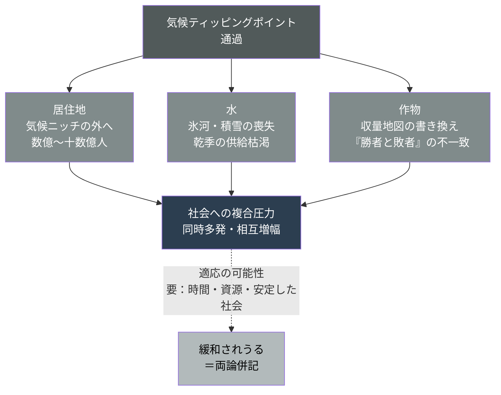

## 5.4 適応という反論

ここで、両論を併記しておく。 
これは本書が終末論に転落しないための、重要な誠実さだ。

人類には適応の能力がある。 
耐熱・耐乾性の作物品種の開発、灌漑技術の高度化、海水淡水化、農業の地理的シフト、都市インフラの改修、空調の普及。 
これらの適応策が十分な速度で展開されれば、被害は大きく緩和されうる。 
技術楽観論は、この適応能力を根拠に、悲観論を退ける。 
人類はこれまでも、数々の環境的困難を技術で乗り越えてきた、と。

この反論には、正当な部分がある。だが、適応には三つの条件がある。 
**時間と、資源と、安定した社会だ。**

適応策を展開するには、年月がかかる。 
新しい作物品種の開発と普及には数十年を要する。 
海水淡水化プラントの建設には莫大な資金が要る。 
そして何より、それらを計画し実行できる、機能する政府と安定した社会が要る。

ところが、ティッピングポイントが急速に連鎖すれば、適応が追いつく前に環境が変わってしまう。 
さらに——次章で見るように——適応に必要な「安定した社会」そのものが、資源の逼迫によって崩れ始める可能性がある。 
適応できる国と、適応する余裕すらない国の格差は、開いていく。

## 5.5 本章のまとめ

本章で確認したのは、不可逆ライン通過後の物理的な帰結である。 
居住可能な気候ニッチが縮小し、数億から十数億の人々がその外に押し出される。 
氷河と積雪に依存する水供給が枯渇する。 
作物の収量地図が書き換わり、その「敗者」が人口の多い地域と重なる。 
適応の可能性は確かにあるが、それには時間と資源と安定した社会という条件が要り、その条件こそが脅かされる。

居住地が狭まり、水が逼迫し、作物の地図が書き換わる。 
これらは、それぞれ単独でも深刻だ。 
だが本当の問題は、これらが同時に起きたとき、人間社会がどう反応するかにある。 
歴史は、その答えを知っている。資源が足りなくなったとき、人は、しばしば、奪い合う。 
次章で、その連鎖を見る。

### 参考文献
- Lenton et al., "Quantifying the human cost of global warming," Nature Sustainability (2023): https://www.nature.com/articles/s41893-023-01132-6
- World Resources Institute, Aqueduct Water Risk Atlas: https://www.wri.org/aqueduct
- IPCC AR6, Working Group II "Impacts, Adaptation and Vulnerability" (2022): https://www.ipcc.ch/report/ar6/wg2/

 

---

# 第6章: 人が、人を襲う

## 6.1 最も慎重に書かれねばならない章

この章は、本書で最も慎重に書かれねばならない。

「気候変動が戦争を起こす」という命題は、強く言いすぎれば誇張になり、弱く言いすぎれば現実を見落とす。 
単線的な因果——気温が上がったから戦争になった——は、科学的に支持されない。 
紛争は常に、政治、経済、民族、宗教、統治の失敗など、多数の要因が絡み合って起きる。 
気候だけを取り出して「これが原因だ」と言うことはできない。

だからこそ、安全保障の専門家たちは、気候変動を「原因」ではなく「脅威増幅器（threat multiplier）」と呼ぶ。 
気候変動それ自体が引き金を引くのではない。 
既存の緊張、既存の脆弱性、既存の対立を、増幅する。 
乾いた薪に火をつけるのではなく、薪をより乾かす役割だ。 
火をつけるのは別の要因かもしれない。 
だが、薪が乾いていれば、同じ火種でも、燃え広がり方がまったく違う。

この枠組みは、もはや環境活動家の主張ではない。 
各国の安全保障機関が、公式に評価している事実だ。

## 6.2 安全保障機関が描く連鎖

米国の情報機関は、機密情報に基づく評価で、気候変動が今後数十年にわたり、 
政治的不安定、大量の難民、テロ、そして水と資源をめぐる紛争を引き起こしうると結論づけてきた。 
これは環境政策の文書ではなく、国家安全保障の評価文書である。 
英国政府が2026年1月に公開した生態系崩壊に関する評価も、安全保障の専門家が、この問題をどれほど深刻に捉えているかを示した。

そこで描かれた連鎖の構造は、明快だ。

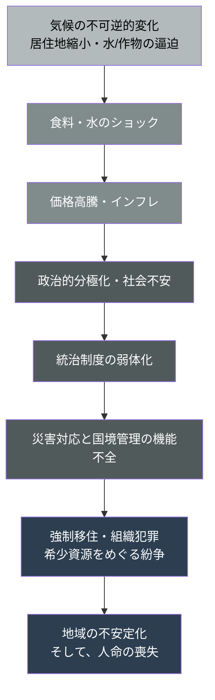

食料と水のショックが価格を高騰させ、インフレが社会不安と政治的分極化を生み、それが統治制度を弱らせ、 
弱った政府は災害対応と国境管理を同時に処理できなくなり、 
その機能不全の中で強制移住、組織犯罪、希少資源をめぐる紛争が噴き出し、地域全体が不安定化する。 
そして、その過程で、人の命が失われる。 
これは一本の鎖だ。最初の環は気候だが、最後の環は人命である。

## 6.3 すでに観測されている萌芽

これは理論ではない。 
すでに、その萌芽は現実に観測されている。

アフリカのサヘル地域では、乾燥化と砂漠化が農地と牧草地を圧迫し、農耕民と牧畜民の間の資源をめぐる衝突が激化してきた。 
水場と耕作地が減れば、それを使う人々の間の競合が激しくなる。 
一部の地域では、こうした衝突が年間で数千人から一万人を超える規模の死者を生んでいる。 
気候だけが原因ではない。民族対立も、統治の失敗も、武器の流入もある。 
だが、気候が、既存の対立を増幅する薪を乾かし続けていることは、否定しがたい。

水をめぐる地政学も、すでに緊張をはらんでいる。 
前章で触れたヒマラヤを水源とする大河を共有するインドとパキスタンは、いずれも核兵器を保有し、長年の対立を抱えている。 
その共有資源である水が、氷河融解によって長期的に不安定化していくとき、何が起きるか。 
上流国が水を制御し、下流国がそれに反発する——この構図は、核保有国の間の緊張を高める要因になりうる。 
安全保障の専門家が、最も警戒するシナリオの一つだ。

世界銀行は、気候変動による国内避難民——いわゆる気候難民——が、今世紀半ばまでに大規模に発生しうると予測している。 
人が土地を追われるとき、その移動は、受け入れ地域に新たな緊張を持ち込む。 
難民の流入は、受け入れ国の社会保障を圧迫し、政治的分極化を促し、排外主義を強める。 
ヨーロッパは、すでにその一端を経験している。

## 6.4 決定論を避ける

繰り返すが、本書はこれらを「確定した未来」として描かない。 
因果は多層的で、不確実性は大きい。 
気候変動があっても紛争にならない地域は多くあるし、適応に成功する社会もある。 
「気候→戦争→大量死」という単線的な物語は、現実の複雑さを切り捨てる。

だが、構造としては、こう言える。 
気候の不可逆的変化は、資源の逼迫を通じて、社会の安定を支える土台を揺さぶる。 
そして、その揺らぎは、最終的に、人の命というコストで支払われる可能性がある。 
安全保障機関は、その可能性を、静かに、しかし真剣に評価している。 
彼らは活動家ではない。最悪の事態に備えることを職業とする、冷静な専門家たちだ。 
その彼らが、これを脅威として評価しているという事実こそが、重い。

## 6.5 本章のまとめ

本章で確認したのは、不可逆ライン通過後の、社会的・安全保障的な帰結である。 
気候変動は紛争の単独の原因ではないが、「脅威増幅器」として既存の対立を増幅する。 
食料・水のショックから、インフレ、政治的分極化、統治の弱体化、強制移住、資源紛争、 
そして人命の喪失へと至る連鎖は、各国の安全保障機関が公式に評価している。 
サヘルの紛争、インド・パキスタンの水を巡る緊張は、その萌芽だ。 
決定論は避けねばならないが、リスク構造として、この連鎖は真剣に評価されている。

ここで、本書の最初の問いに戻る。 
これほど深刻な帰結がありうるなら、なぜ、世界はそれを直視しないのか。 
なぜ、数十兆円の投資の意思決定に、この時間軸とこの帰結が、計算として入らないのか。 
その答えは、地球の側にはない。人間の頭の中にある。

### 参考文献
- U.S. National Intelligence Council, "Climate Change and International Responses Increasing Challenges to US National Security Through 2040" (NIE): https://www.dni.gov/files/ODNI/documents/assessments/NIE_Climate_Change_and_National_Security.pdf
- UK Government, Ecosystem collapse risk assessment (FOI release, 2026): https://www.gov.uk/government/publications
- World Bank, "Groundswell: Acting on Internal Climate Migration" (2021): https://openknowledge.worldbank.org/handle/10986/36248

 

---

# 第7章: なぜ、誰も賭け金を数えないのか

## 7.1 脅威を等しく評価しない脳

序章で触れた、人間の計算の癖を、ここで科学として回収する。

人間の脳は、脅威を等しく評価しない。 
脅威が「近い」ほど、「目に見える」ほど、「自分ごと」であるほど、大きく評価する。 
逆に、脅威が「遠い」「見えない」「確率的」「自分の責任が拡散している」ほど、過小評価する。

これは進化の産物だ。 
サバンナで暮らした人類の祖先にとって、重要だったのは、目の前のライオン、明日の食料、今夜の安全だった。 
数十年後の環境変化を心配する個体より、目の前の危険に即座に反応する個体のほうが、生き延びて子孫を残した。 
だから私たちの脳は、近い脅威に鋭敏で、遠い脅威に鈍感にできている。 
これは欠陥ではなく、かつては最適だった設計だ。

## 7.2 気候変動という「理想的に過小評価される脅威」

気候変動による不可逆的破局は、この過小評価される条件を、すべて満たしている。

それは時間的に遠い。数十年先の話に見える。視覚的に見えにくい。 
CO2は無色透明で、増えていく様子を肉眼で見ることはできない。 
発生は確率的だ。「いつ」「どこで」「どの程度」が、確率の幅でしか語れない。 
そして、責任は世界中に拡散していて、誰か一人のものではない。 
自分一人が行動を変えても、全体はほとんど変わらない。

心理学者ダニエル・ギルバートは、気候変動を「人間の脳が警戒するようにできていない、ほぼ理想的な脅威」と評した。 
もし気候変動が、悪意ある人間がやっていることなら、あるいは目に見える形で道徳に反することなら、人類はとっくに立ち上がっていただろう、と。 
脳は、忍び寄るものより、飛びかかってくるものに反応するよう進化したのだ。

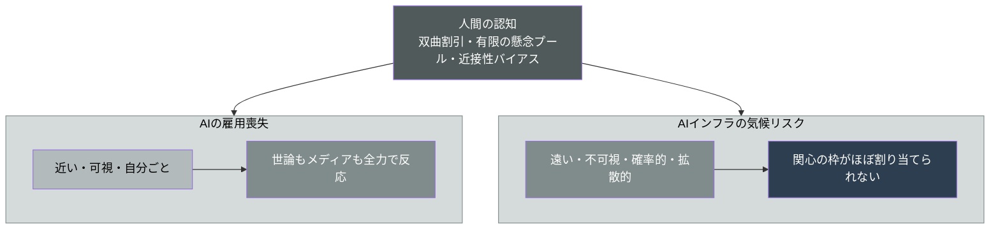

行動経済学は、これを裏付ける概念を複数持っている。 
双曲割引——未来の損失を、近い損失より過度に軽く見積もる。 
有限の懸念プール——同時に心配できる量に限りがあり、目の前の不安が枠を占めると遠くの不安が締め出される。 
近接性バイアス——時間的・空間的に近い事象を、遠い事象より重く扱う。

これらが組み合わさると、何が起きるか。 
AIの雇用喪失——近く、見え、自分ごと——には、世論もメディアも全力で反応する。 
一方、AIインフラのエネルギーが押し上げる気候の不可逆リスク——遠く、見えず、拡散——には、関心の枠がほとんど割り当てられない。 
同じ「AIのリスク」でありながら、この非対称は、世論調査でも、メディアの露出量でも、はっきりと観測できる。

つまり、世界が賭け金を数えないのは、世界が愚かだからではない。 
**人間の認知が、長期・不可視・確率的・拡散的な脅威を構造的に過小評価するようにできているからだ。**  
世界で最も賢い人々ですら、この認知の癖からは自由ではない。 
むしろ、目の前のAI競争という「近い」勝負に集中しているからこそ、遠い時間軸の賭け金が見えなくなる。

## 7.3 三つの反論に答える

ここで、本書の主張に対する、ありうる反論に正面から答えておく。 
誠実な議論には、最強の反論への応答が要る。

**第一の反論は「AIの効率化便益が、排出を上回る」というものだ。** 
第2章で見たIEAの「5%削減余地」の議論である。これは可能性としては成立する。 
だが、強い実証コンセンサスがあるわけではない。 
効率化が消費の絶対量の増加に追い抜かれる「ジェヴォンズのパラドックス」 
——効率が上がるほど利用が増え、総消費がかえって増える現象——への反論が、十分にできていない。 
実際、Googleは2024年に運用改善でデータセンターの排出原単位を削減したと報告したが、 
同じ年、データセンターの絶対的な電力消費は前年比27%増えた。 
原単位は下がり、絶対量は増える。これがAIエネルギーの構造的ジレンマだ。 
効率化は、消費を減らすのではなく、より多くの消費を正当化する。

**第二の反論は「データセンターのCO2は世界の1%。騒ぎすぎだ」というものだ。** 
本書は、この1%という数字を否定しない。 
だが本書の論点は、第4章で示した通り、量ではなく時間にある。 
世界排出の1%か2%かではなく、その排出が、不可逆ラインを越える数年間に、化石燃料という形で加担するかどうかだ。 
小さなパーセンテージでも、それが最悪のタイミングで、最後のドミノを倒す位置に上乗せされるなら、意味がまったく違う。

**第三に、本書の問題提起そのものへの反論——「誰も気づいていない、というのは誇張だ。論じている人はいる」。** 
これは正しい。 
気候科学者は警告し、安全保障機関は評価し、一部のジャーナリストは報じている。 
「誰も論じていない」というのは、事実としては誤りだ。

だが、本書が指すのは、別のことだ。論者は存在する。 
しかし断片的だ。 
AI投資の規模を論じる人と、気候のティッピングポイントを論じる人と、安全保障の連鎖を論じる人は、別々にいる。 
この四つ——AIインフラ投資、気候の不可逆性、安全保障の帰結、 
そして人間の認知バイアス——を一本の線でつなぎ、「時間軸の衝突」として統合した視座が、決定的に不足している。 
賭け金は、あちこちに散らばって記録されている。 
だが、誰もそれを一枚の請求書にまとめていない。本書が立つのは、その空白だ。

## 7.4 本章のまとめ

本章で確認したのは、なぜ人類がこの賭け金を数えないのか、その認知的な理由である。 
人間の脳は、近い・可視・自分ごとの脅威に鋭敏で、遠い・不可視・確率的・拡散的な脅威に鈍感にできている。 
気候変動は、後者の条件をすべて満たす「理想的に過小評価される脅威」だ。 
だから、AIの雇用喪失は騒がれ、AIインフラの気候リスクは見過ごされる。 
これは愚かさではなく、認知の構造だ。 
そして本書は、効率化便益・1%論・既出論という三つの反論に応答した上で、四つの議論を統合する視座の空白に立つ。

### 参考文献
- Gilbert, D., "If only gay sex caused global warming," Los Angeles Times (2006): https://www.latimes.com/archives/la-xpm-2006-jul-02-op-gilbert2-story.html
- Weber, E. U., "Experience-based and description-based perceptions of long-term risk," Climatic Change (2006): https://link.springer.com/article/10.1007/s10584-006-9060-3
- Luccioni et al., "Power Hungry Processing: Watts Driving the Cost of AI Deployment?" arXiv 2311.16863: https://arxiv.org/abs/2311.16863

 

---

# 終章: 賭けを、可視化する

## 賭けの全体像

ここまで読んだあなたは、もう、最初の問いに対する答えを持っている。

「数十兆円のAIインフラ投資で、どれだけのCO2が出て、地球に何をもたらすのか」。

答えは、こうだ。 
CO2の絶対量は、世界全体では小さい。それは事実だ。 
だが、その排出が積み上がる数年間は、地球が不可逆の臨界点に近づく、最も危険な数年間と重なっている。 
そして、その一線を越えた先には、居住地の縮小、水と作物の争奪、紛争、 
そして人命の喪失という帰結が、安全保障機関の評価として、静かに記録されている。 
にもかかわらず、人類は、この長期・不可視の脅威を、認知の構造ゆえに過小評価している。

本書の論理の全体を、最後に一枚で振り返る。

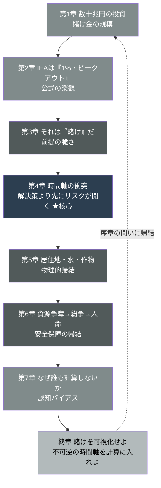

これが、賭けの全体像だ。

## 三つの不可逆性

本書が描いた構造には、三つの「不可逆性」が重なっている。 
これが、この賭けを特別に重いものにしている。

**第一の不可逆性は、インフラの不可逆性だ。** 
一度建てた天然ガス発電所は、数十年にわたって稼働し、CO2を出し続ける。 
「つなぎ」のつもりで建てた化石燃料設備は、簡単には撤去されない。 
投資が固定資産になった瞬間、その排出は数十年分、予約される。

**第二の不可逆性は、気候の不可逆性だ。** 
ティッピングポイントを越えた気候システムは、人間の時間スケールでは元に戻らない。 
融けた氷床は戻らず、死んだサンゴ礁は戻らず、崩れた海洋循環は戻らない。 
CO2をゼロにしても、越えた一線は越えたままだ。

**第三の不可逆性は、人命の不可逆性だ。** 
資源紛争で失われた命は、戻らない。 
崩壊した社会の中で失われた一世代の未来は、取り返せない。

この三つの不可逆性が、時間軸の上で重なっている。 
それが「時間軸の衝突」の本当の重さだ。

## 本書が語らなかったこと

本書は「AIを止めろ」とは言わない。AIの便益は本物だ。 
AIは、エネルギーの効率化にも、脱炭素技術の開発にも、医療にも、教育にも、貢献しうる。 
私はAI戦略を専門とする立場であり、AIの可能性を誰よりも信じている。本書は、反AIの書ではない。

本書はまた、具体的な政策提言の書でもない。 
炭素税をいくらにすべきか、原子力をどう加速すべきか、再エネ投資をどう配分すべきか 
——これらの各論は、本書の射程の外にある。 
それぞれに専門家がいて、専門の議論がある。

本書の主張は、たった一点に集約される。

**不可逆ラインの「時間軸」を、投資の意思決定の計算に入れよ。**

いま、数十兆円の投資判断は、「SMRはいずれ間に合う」「再エネはいずれ追いつく」という、時間を無視した前提の上で進んでいる。 
その「いずれ」が、地球の臨界点より後なら、その投資は、最悪のタイミングで化石燃料に加担する賭けになる。 
賭けをするなとは言わない。だが、賭ける前に、賭け金を数えよ。負けたときに失うものを、計算に入れよ。 
それが、本書の唯一の要求だ。

## 構造の先にあるもの

では、誰が、その計算をするのか。

それは、AIインフラに投資する資本家であり、政策を設計する政府であり、データセンターを建てる企業であり、そして、この問題を報じるメディアだ。 
賭け金を可視化し、不可逆の時間軸を意思決定に組み込む責任は、この賭けに参加している全員にある。

だが、その計算を可能にするには、特殊な「眼」が要る。 
AIインフラ投資という「ビジネス」、気候とエネルギーという「テクノロジー」、そして人間の認知と社会の反応という「人間理解」 
——この三つの領域を越境して、一本の線でつなぐ眼だ。 
専門が分断されているから、賭け金が散らばったまま、誰も請求書をまとめられない。 
本書がやろうとしたのは、その分断を越えて、一枚の請求書を書くことだった。

私は、この越境する眼を、Business・Technology・Creativeの三領域を統合する「BTC人材」として、 
そして人とAIの共創方法論「Depth & Velocity」として、体系化してきた。 
本書が描いた「時間軸の衝突」を直視し、計算するための思考の枠組みは、その延長線上にある。

---

人間は、忍び寄る脅威より、飛びかかる脅威に反応するよう、できている。

それは、生き延びるための、合理的な進化だった。 
サバンナでは、遠い未来より、目の前のライオンが重要だった。

だが、いま人類が直面しているのは、サバンナのライオンではない。 
何十年もかけて忍び寄り、ある一線を越えた瞬間に、二度と引き返せなくなる種類の脅威だ。 
この脅威に対して、人間の認知は、設計上、無防備だ。

だからこそ、計算が要る。 
直感が警報を鳴らさないのなら、数字で、構造で、賭け金を机の上に並べるしかない。

あなたは、この賭けの賭け金を知った。 
知った上で、なお、見ないふりを続けるのか。それとも、計算を始めるのか。 
それを決めるのは、いまを生きている、私たち自身だ。

### 参考文献
- 山内怜史, "Depth & Velocity: A New OS for Building Businesses in the Generative AI Era," Leading.AI (CC BY 4.0): https://github.com/Leading-AI-IO/depth-and-velocity
- 山内怜史, "The Orchestrator — The Rarest Role in the AI Era," Leading.AI (CC BY 4.0): https://github.com/Leading-AI-IO/the-orchestrator-in-the-ai-era

 

---

*本書は、ChatGPT・Claude・Geminiによる3エンジンのDeep Research結果を統合し、IEA「Energy and AI」、LBNL「Queued Up 2025」、WMO年次10年気候見通し、Global Tipping Points Report 2025、各国安全保障評価、および各社決算開示等の一次情報に基づいて構造化された。数値は公表時点のものであり、シナリオの前提（特にSMR・送電網・再エネの進捗）の変化に応じて更新されるべきものである。*

*Leading.AI / CC BY 4.0*
